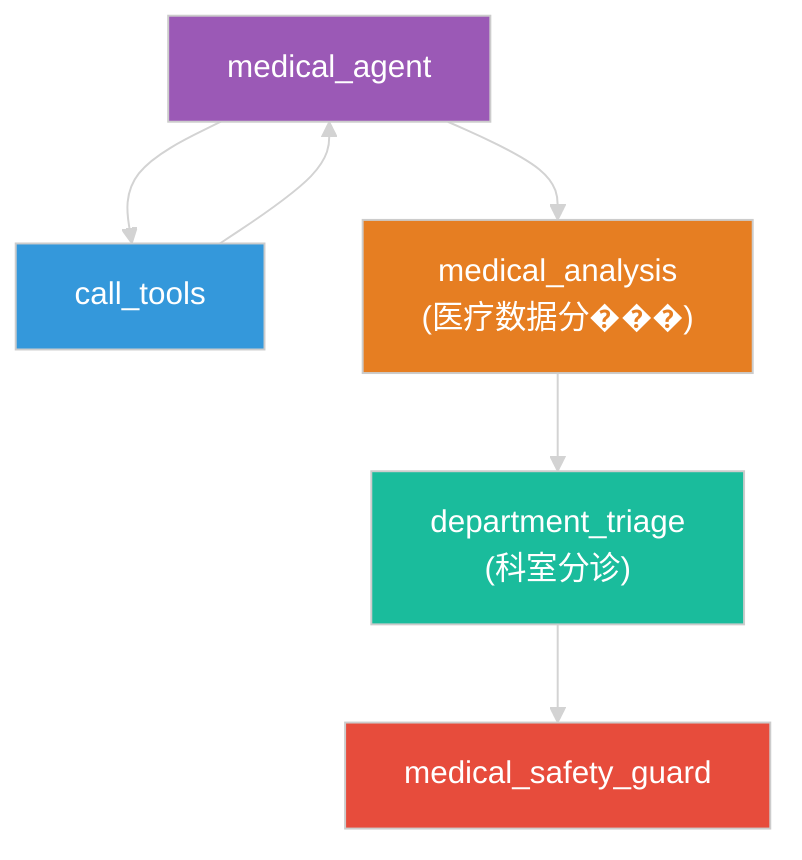

# 医疗节点功能分离优化方案

## 一、现状分析

### 1. 功能重叠问题
- **medical_analysis 节点**：负责医疗数据综合分析，同时也包含科室推荐功能
- **department_triage 节点**：负责科室分诊，同时也处理风险评估
- **重叠功能**：科室推荐、风险评估、结果分析

### 2. 代码冗余
- 两个节点都处理相似的错误情况和边界条件
- 两个节点都涉及科室相关的逻辑
- 两个节点都处理风险等级和紧急度

## 二、优化目标

### 1. 明确功能边界
- **medical_analysis**：只负责医疗数据的分析和风险评估
- **department_triage**：只负责基于分析结果的科室推荐

### 2. 移除冗余代码
- 删除重复的错误处理逻辑
- 统一科室相关的验证逻辑
- 明确风险评估和紧急度计算的责任

## 三、详细优化方案

### 1. medical_analysis 节点优化

#### 核心职责
- 综合分析医疗工具输出
- 生成结构化医疗分析报告
- 评估并设置风险等级
- **移除**科室推荐功能

#### 代码修改
1. **修改输出结构**：
   - 从 `medical_analysis_result` 中移除 `departments` 字段
   - 专注于医疗数据的分析和风险评估

2. **简化逻辑**：
   - 移除与科室相关的所有逻辑
   - 专注于医疗数据的技术分析

3. **输出示例**：
   ```json
   {
     "summary": "综合分析报告",
     "risk_level": "medium",
     "abnormal_indicators": ["体温", "心率"]
   }
   ```

### 2. department_triage 节点优化

#### 核心职责
- 基于医疗分析结果推荐科室
- 验证科室白名单和模糊匹配
- 计算紧急度
- 生成分诊理由

#### 代码修改
1. **增强科室验证**：
   - 保留并优化科室白名单验证
   - 增强科室名称模糊匹配功能

2. **简化风险处理**：
   - 直接使用 `medical_analysis` 节点的风险评估结果
   - 不再重复计算风险等级

3. **专注分诊逻辑**：
   - 专注于基于分析结果的科室推荐
   - 生成分诊建议和理由

4. **输出示例**：
   ```json
   {
     "recommended_departments": ["呼吸内科", "感染科"],
     "primary_department": "呼吸内科",
     "urgency_level": "urgent",
     "triage_reason": "根据发热和咳嗽症状，建议前往呼吸内科就诊",
     "triage_confidence": 0.85
   }
   ```

### 3. 接口标准化

#### 输入输出标准化
- **medical_analysis 输入**：
  - state（包含 messages）
  - config
  - llm_chat
  - middleware_manager

- **medical_analysis 输出**：
  - messages
  - medical_analysis_result（包含 summary、risk_level、abnormal_indicators）
  - risk_level

- **department_triage 输入**：
  - state（包含 messages、medical_analysis_result、risk_level）
  - config
  - llm_chat
  - middleware_manager

- **department_triage 输出**：
  - messages
  - department_triage_result（包含 recommended_departments、primary_department、urgency_level、triage_reason、triage_confidence）

### 4. 数据流向优化



## 四、实施步骤

### 1. 分析现有代码
- 详细分析两个节点的代码结构
- 识别重叠功能和冗余代码
- 确定需要修改的部分

### 2. 修改 medical_analysis 节点
- 移除科室推荐功能
- 简化输出结构
- 专注于医疗数据的分析和风险评估

### 3. 修改 department_triage 节点
- 增强科室验证功能
- 简化风险处理逻辑
- 专注于科室推荐和分诊

### 4. 更新 StateGraph 配置
- 确保节点间的连接关系正确
- 验证数据流向符合设计

### 5. 测试验证
- 运行单元测试
- 进行集成测试
- 验证向后兼容性

## 五、预期效果

### 1. 功能明确
- 每个节点都有清晰的职责边界
- 功能划分合理，避免重叠

### 2. 代码简化
- 移除冗余代码，提高代码可读性
- 减少维护成本

### 3. 性能提升
- 减少重复计算
- 提高系统响应速度

### 4. 可维护性
- 代码结构清晰，易于理解
- 便于后续扩展和修改

### 5. 向后兼容
- 保持输出格式与原系统兼容
- 确保现有功能不受影响

## 六、风险评估

### 1. 潜在风险
- 功能分离可能影响现有功能
- 接口变更可能导致兼容性问题
- 测试覆盖不足可能引入新问题

### 2. 风险缓解
- 详细测试验证
- 保持向后兼容
- 逐步实施，分阶段测试

## 七、结论

通过功能分离方案，我们可以：
1. **明确功能边界**：每个节点都有清晰的职责
2. **移除冗余代码**：减少重复逻辑，提高代码质量
3. **优化系统性能**：减少重复计算，提高响应速度
4. **提升可维护性**：代码结构清晰，易于理解和维护
5. **保持向后兼容**：确保现有功能不受影响

这种优化方案不仅解决了功能重叠问题，还提高了系统的整体性能和可维护性，为用户提供更快速、更准确的医疗分析和分诊服务。