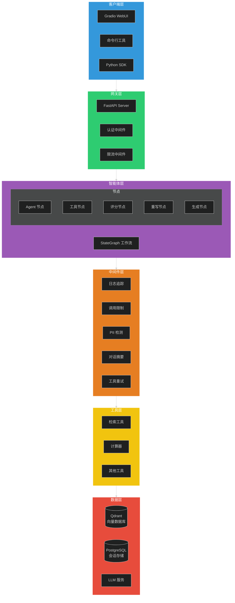
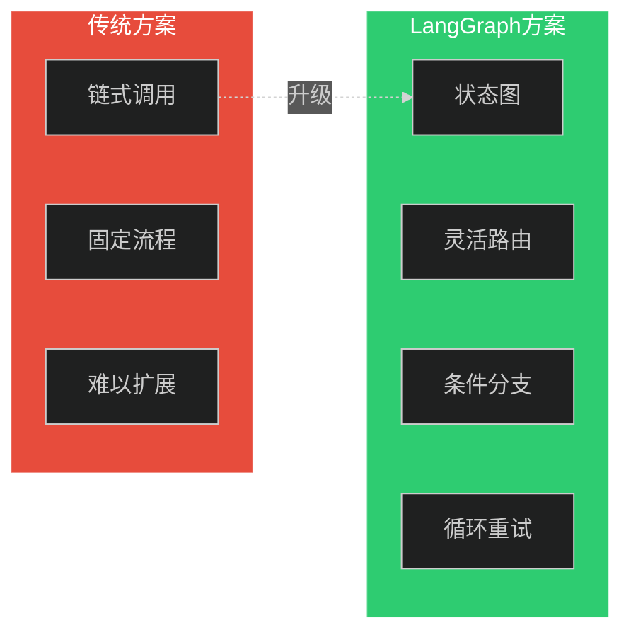
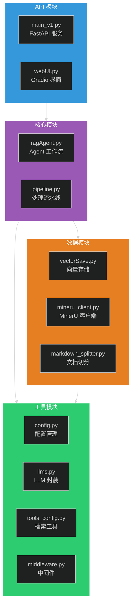
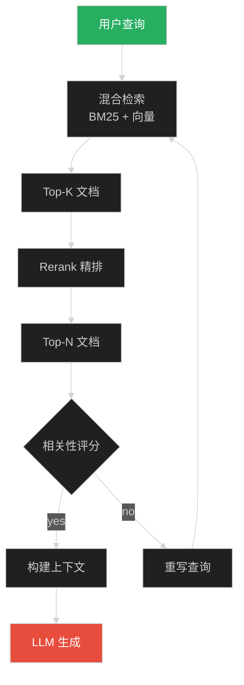
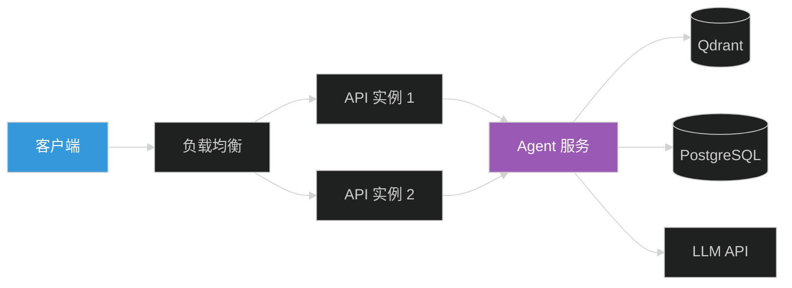
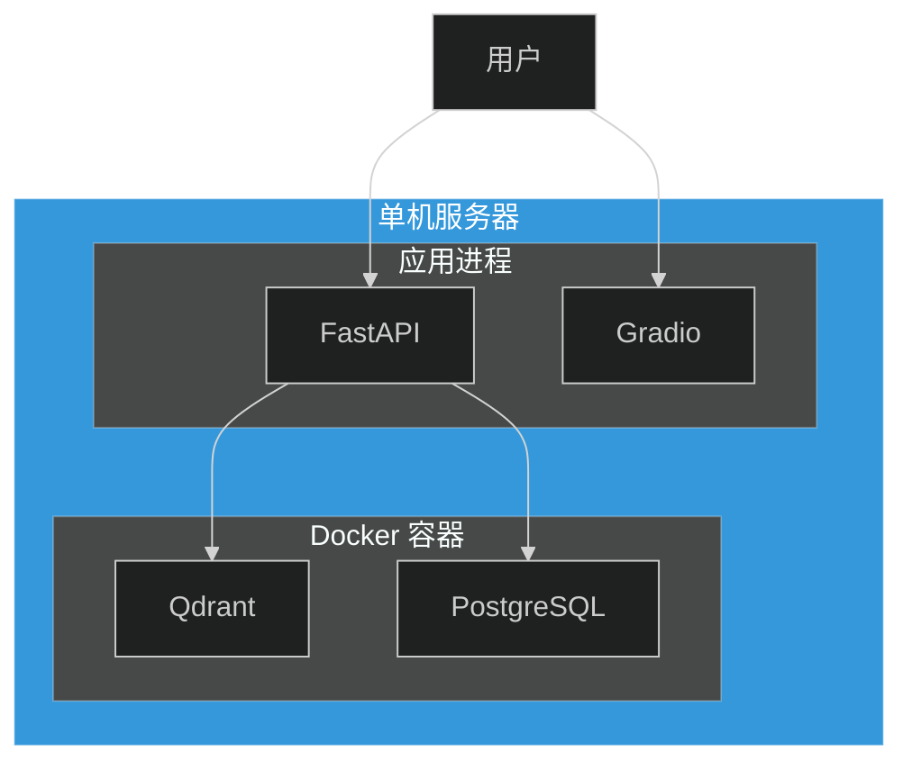
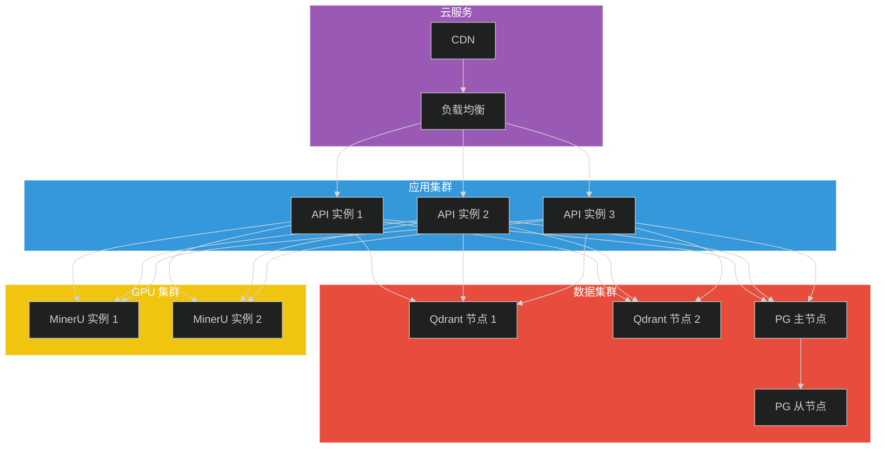

# 系统架构设计文档

本文档面向架构师和技术决策者，详细说明系统的架构设计、技术选型和模块设计。

## 目录

- [一、系统架构概览](#一系统架构概览)
- [二、技术选型](#二技术选型)
- [三、模块设计](#三模块设计)
- [四、数据流设计](#四数据流设计)
- [五、API 设计](#五api-设计)
- [六、部署架构](#六部署架构)
- [七、扩展性设计](#七扩展性设计)

---

## 一、系统架构概览

### 1.1 系统架构图



### 1.2 核心设计原则

| 原则 | 说明 |
|------|------|
| **模块化** | 各组件职责单一，松耦合设计 |
| **可扩展** | 支持水平扩展和垂直扩展 |
| **可观测** | 完整的日志、追踪和监控 |
| **容错性** | 自动重试、降级和熔断机制 |
| **安全性** | PII 检测、调用限制、权限控制 |

---

## 二、技术选型

### 2.1 技术栈总览

| 层级 | 技术选型 | 选型理由 |
|------|----------|----------|
| **工作流引擎** | LangGraph | 灵活的状态图，支持复杂工作流 |
| **LLM 框架** | LangChain v1 | 丰富的集成，Middleware 支持 |
| **向量数据库** | Qdrant | 高性能，支持混合检索 |
| **关系数据库** | PostgreSQL | 可靠性高，支持 LangGraph 持久化 |
| **API 框架** | FastAPI | 高性能，原生异步支持 |
| **Web 框架** | Gradio | 快速构建 ML 应用界面 |
| **文档解析** | MinerU | GPU 加速，高保真 Markdown 输出 |
| **容器编排** | Docker Compose | 简单易用，适合中小规模部署 |

### 2.2 LangGraph 选型分析



**LangGraph 优势：**

| 特性 | 说明 |
|------|------|
| 状态管理 | 内置状态传递和持久化 |
| 条件路由 | 支持基于状态的动态路由 |
| 循环支持 | 原生支持循环和重试逻辑 |
| 可观测性 | 集成 LangSmith 追踪 |
| 人工介入 | 支持 human-in-the-loop |

### 2.3 向量数据库选型

| 特性 | Qdrant | ChromaDB | Milvus |
|------|--------|----------|--------|
| 性能 | ⭐⭐⭐⭐⭐ | ⭐⭐⭐ | ⭐⭐⭐⭐ |
| 混合检索 | ✅ | ❌ | ✅ |
| 部署复杂度 | 低 | 低 | 高 |
| 元数据过滤 | ✅ | ✅ | ✅ |
| 社区活跃度 | 高 | 高 | 高 |

**选择 Qdrant 的理由：**
- 原生支持 BM25 + 向量混合检索
- 单机部署简单，性能优异
- Rust 实现，内存占用低

### 2.4 LLM 提供商支持

```python
# 统一的 LLM 接口抽象
class LLMProvider:
    """LLM 提供商抽象基类"""
    
    def get_chat_model(self) -> BaseChatModel:
        """获取聊天模型"""
        pass
    
    def get_embeddings(self) -> Embeddings:
        """获取 Embedding 模型"""
        pass

# 支持的提供商
PROVIDERS = {
    "openai": OpenAIProvider,
    "qwen": QwenProvider,
    "ollama": OllamaProvider,
    "oneapi": OneAPIProvider,
}
```

---

## 三、模块设计

### 3.1 模块划分



### 3.2 核心模块详解

#### 3.2.1 RAG Agent (ragAgent.py)

```python
class RAGAgent:
    """
    RAG Agent 主类，基于 LangGraph StateGraph 构建。
    
    Attributes:
        graph: StateGraph 工作流实例
        checkpointer: 会话持久化存储
        middleware_chain: 中间件链
    """
    
    def __init__(self, config: AgentConfig):
        """
        初始化 RAG Agent。
        
        Args:
            config: Agent 配置对象
        """
        self._build_graph()
        self._setup_middleware()
    
    def _build_graph(self):
        """构建 StateGraph 工作流"""
        self.graph = StateGraph(AgentState)
        self.graph.add_node("agent", self._agent_node)
        self.graph.add_node("tools", self._tools_node)
        self.graph.add_node("grade", self._grade_node)
        self.graph.add_node("rewrite", self._rewrite_node)
        self.graph.add_node("generate", self._generate_node)
        
        # 定义边和条件路由
        self.graph.add_edge(START, "agent")
        self.graph.add_conditional_edges("agent", self._tools_condition)
        # ...
    
    def invoke(self, query: str, config: RunnableConfig = None) -> dict:
        """
        执行查询。
        
        Args:
            query: 用户查询
            config: 运行配置
            
        Returns:
            dict: 包含响应和元数据的结果
        """
        pass
```

#### 3.2.2 配置管理 (utils/config.py)

```python
class Config:
    """
    统一配置管理类。
    
    配置优先级：
    1. 环境变量（最高）
    2. .env 文件
    3. 代码默认值（最低）
    """
    
    # LLM 配置
    LLM_TYPE: str = "qwen"
    DASHSCOPE_API_KEY: str = ""
    OPENAI_API_KEY: str = ""
    
    # MinerU 配置
    MINERU_API_URL: str = "http://localhost:8000"
    MINERU_TIMEOUT: int = 300
    
    # Qdrant 配置
    QDRANT_URL: str = "http://127.0.0.1:6333"
    QDRANT_COLLECTION_NAME: str = "knowledge_base_v2"
    
    @classmethod
    def validate_config(cls) -> dict:
        """
        验证配置完整性。
        
        Returns:
            dict: 验证结果，包含 valid, issues 等字段
        """
        pass
```

#### 3.2.3 Middleware (utils/middleware.py)

```python
class MiddlewareManager:
    """
    中间件管理器，协调多个中间件的执行。
    
    执行顺序：
    请求 → Logging → PII → Limit → Agent → Summary → 响应
    """
    
    def __init__(self, middlewares: list[Middleware]):
        """
        初始化中间件管理器。
        
        Args:
            middlewares: 中间件列表
        """
        self.middlewares = middlewares
    
    def process_request(self, request: Request) -> Request:
        """处理请求"""
        for mw in self.middlewares:
            request = mw.before_invoke(request)
        return request
    
    def process_response(self, response: Response) -> Response:
        """处理响应"""
        for mw in reversed(self.middlewares):
            response = mw.after_invoke(response)
        return response
```

### 3.3 数据模块详解

#### 3.3.1 向量存储 (vectorSave.py)

```python
class VectorStoreV2:
    """
    增强向量存储引擎，支持元数据存储和混合检索。
    
    Features:
        - 支持带元数据的向量存储
        - 支持 BM25 + 向量混合检索
        - 支持增量更新和删除
    """
    
    def upsert_with_metadata(
        self,
        texts: list[str],
        metadatas: list[dict],
        use_context_prefix: bool = True
    ) -> list[str]:
        """
        带元数据的向量存储。
        
        Args:
            texts: 文本列表
            metadatas: 元数据列表
            use_context_prefix: 是否添加上下文前缀
            
        Returns:
            list[str]: 向量 ID 列表
        """
        pass
    
    def hybrid_search(
        self,
        query: str,
        top_k: int = 5,
        sparse_weight: float = 0.3
    ) -> list[SearchResult]:
        """
        混合检索（BM25 + 向量）。
        
        Args:
            query: 查询文本
            top_k: 返回数量
            sparse_weight: BM25 权重
            
        Returns:
            list[SearchResult]: 检索结果
        """
        pass
```

#### 3.3.2 文档切分 (markdown_splitter.py)

```python
class MarkdownSplitter:
    """
    两阶段语义切分器。
    
    阶段A: 按 Markdown 标题层级切分
    阶段B: 对超长段落递归切分
    """
    
    def split_text(self, text: str) -> list[Chunk]:
        """
        切分 Markdown 文本。
        
        Args:
            text: Markdown 文本
            
        Returns:
            list[Chunk]: 切分结果，包含内容和元数据
        """
        # 阶段A: 标题切分
        chunks = self._split_by_headers(text)
        
        # 阶段B: 递归切分超长段落
        final_chunks = []
        for chunk in chunks:
            if len(chunk.content) > self.chunk_size:
                final_chunks.extend(self._recursive_split(chunk))
            else:
                final_chunks.append(chunk)
        
        return final_chunks
```

---

## 四、数据流设计

### 4.1 知识库构建流程


### 4.2 检索流程



### 4.3 Agent 工作流状态机

```python
from typing import TypedDict, Annotated

class AgentState(TypedDict):
    """Agent 状态定义"""
    messages: Annotated[list, "消息历史"]
    documents: Annotated[list, "检索文档"]
    relevance: Annotated[str, "相关性评分"]
    rewrite_count: Annotated[int, "重写次数"]
    tool_calls: Annotated[list, "工具调用记录"]

# 状态转换规则
TRANSITIONS = {
    "agent": {
        "tools": "tools_condition",  # 条件：是否调用工具
        "end": "no_tools"            # 无工具调用则结束
    },
    "tools": {
        "grade": "is_retrieve_tool",  # 检索工具 → 评分
        "generate": "is_other_tool"   # 其他工具 → 生成
    },
    "grade": {
        "generate": "relevant",       # 相关 → 生成
        "rewrite": "not_relevant"     # 不相关 → 重写
    },
    "rewrite": {
        "agent": "always"             # 重写后回到 Agent
    },
    "generate": {
        "end": "always"               # 生成后结束
    }
}
```

---

## 五、API 设计

### 5.1 API 架构



### 5.2 接口规范

#### 5.2.1 聊天接口

```yaml
POST /v1/chat/completions
Content-Type: application/json

Request:
  messages: array[Message]    # 消息历史
  stream: boolean             # 是否流式
  userId: string              # 用户 ID
  conversationId: string      # 会话 ID
  temperature: number         # 温度参数
  max_tokens: number          # 最大 token 数

Response:
  id: string                  # 响应 ID
  object: string              # 对象类型
  created: number             # 创建时间戳
  choices: array[Choice]      # 响应选项
  usage: Usage                # Token 使用统计
```

#### 5.2.2 响应格式

```typescript
// 非流式响应
interface ChatCompletion {
  id: string;
  object: "chat.completion";
  created: number;
  choices: [{
    index: number;
    message: {
      role: "assistant";
      content: string;
    };
    finish_reason: "stop" | "length" | "tool_calls";
  }];
  usage: {
    prompt_tokens: number;
    completion_tokens: number;
    total_tokens: number;
  };
}

// 流式响应 (SSE)
interface ChatCompletionChunk {
  id: string;
  object: "chat.completion.chunk";
  created: number;
  choices: [{
    index: number;
    delta: {
      role?: "assistant";
      content?: string;
    };
    finish_reason: "stop" | "length" | null;
  }];
}
```

### 5.3 错误处理

```python
class APIError(Exception):
    """API 错误基类"""
    
    def __init__(self, code: str, message: str, status_code: int = 500):
        self.code = code
        self.message = message
        self.status_code = status_code

# 错误码定义
ERROR_CODES = {
    "INVALID_REQUEST": ("invalid_request", 400),
    "AUTHENTICATION_ERROR": ("authentication_error", 401),
    "RATE_LIMIT_EXCEEDED": ("rate_limit_exceeded", 429),
    "MODEL_OVERLOADED": ("model_overloaded", 503),
    "INTERNAL_ERROR": ("internal_error", 500),
}
```

---

## 六、部署架构

### 6.1 单机部署架构



### 6.2 分布式部署架构



### 6.3 网络拓扑

```
┌─────────────────────────────────────────────────────────────┐
│                        公网 (HTTPS)                          │
└─────────────────────────────────────────────────────────────┘
                              │
                              ▼
┌─────────────────────────────────────────────────────────────┐
│                     负载均衡 (Nginx/ALB)                     │
│                     端口: 443 → 8000                         │
└─────────────────────────────────────────────────────────────┘
                              │
              ┌───────────────┼───────────────┐
              ▼               ▼               ▼
┌─────────────────┐ ┌─────────────────┐ ┌─────────────────┐
│   API 实例 1    │ │   API 实例 2    │ │   API 实例 3    │
│   端口: 8000    │ │   端口: 8000    │ │   端口: 8000    │
└─────────────────┘ └─────────────────┘ └─────────────────┘
              │               │               │
              └───────────────┼───────────────┘
                              │
              ┌───────────────┼───────────────┐
              ▼               ▼               ▼
┌─────────────────┐ ┌─────────────────┐ ┌─────────────────┐
│    Qdrant       │ │   PostgreSQL    │ │   MinerU GPU    │
│   端口: 6333    │ │   端口: 5432    │ │   端口: 8000    │
└─────────────────┘ └─────────────────┘ └─────────────────┘
```

---

## 七、扩展性设计

### 7.1 水平扩展策略

| 组件 | 扩展方式 | 说明 |
|------|----------|------|
| API 服务 | 无状态设计 | 可任意扩展实例数 |
| Qdrant | 分片集群 | 按集合分片 |
| PostgreSQL | 读写分离 | 主从复制 |
| MinerU | 多实例 | 负载均衡分发 |

### 7.2 扩展点设计

```python
# 工具扩展点
class BaseTool(Protocol):
    """工具基类协议"""
    
    name: str
    description: str
    
    def run(self, input: str) -> str:
        """执行工具"""
        ...

# Middleware 扩展点
class Middleware(Protocol):
    """中间件协议"""
    
    def before_invoke(self, request: Request) -> Request:
        """请求预处理"""
        ...
    
    def after_invoke(self, response: Response) -> Response:
        """响应后处理"""
        ...

# LLM 扩展点
class LLMProvider(Protocol):
    """LLM 提供商协议"""
    
    def get_chat_model(self) -> BaseChatModel:
        """获取聊天模型"""
        ...
    
    def get_embeddings(self) -> Embeddings:
        """获取 Embedding"""
        ...
```

### 7.3 性能优化建议

| 优化项 | 建议 | 预期收益 |
|--------|------|----------|
| 向量检索 | 调整 `search_kwargs={"k": 5}` | 减少无关文档 |
| Rerank | 调整 `top_n=3` | 提高相关性 |
| 并发 | 调整 `max_workers=5` | 提高吞吐量 |
| 缓存 | 添加向量缓存层 | 减少重复计算 |
| 连接池 | PostgreSQL 连接池 | 减少连接开销 |

---

## 八、安全设计

### 8.1 安全架构


### 8.2 安全措施

| 层级 | 措施 | 实现 |
|------|------|------|
| 网络层 | HTTPS | TLS 1.3 |
| 应用层 | 认证 | API Key / JWT |
| 应用层 | 限流 | 令牌桶算法 |
| 数据层 | PII 检测 | 正则 + NER |
| 数据层 | 加密 | AES-256 |

---

**文档版本**: v1.0.0 | **更新日期**: 2026-04-03
