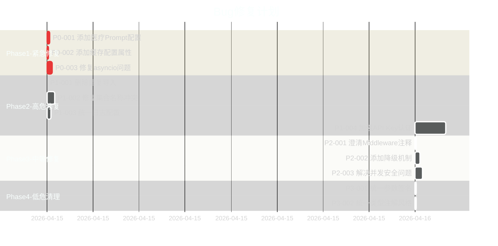

# 项目问题追踪清单

> 📅 最后更新: 2026-04-15  
> 📊 审计范围: 42个Python文件，12个模块  
> 🔍 审计方法: 逐行代码审查 + 溯源分析

---

## 📋 问题统计总览

| 严重程度 | 数量 | 占比 | 状态 |
|----------|------|------|------|
| 🔴 P0-严重 | 3 | 25% | ✅ 已修复 |
| 🟠 P1-高 | 4 | 33% | ⏳ 待修复 |
| 🟡 P2-中 | 3 | 25% | ⏳ 待修复 |
| 🟢 P3-低 | 2 | 17% | ⏳ 待修复 |
| **合计** | **12** | **100%** | - |

---

## 🔴 P0级 - 严重Bug（阻塞功能）

### BUG-P0-001: Config类缺少医疗Prompt模板配置属性

**优先级**: 🔴🔴🔴 **紧急**  
**状态**: ⏳ 待修复  
**发现日期**: 2026-04-15

#### 问题详情
- **位置**: `utils/config/service_config.py:1-54`
- **类型**: AttributeError（运行时崩溃）
- **影响范围**: 整个医疗分诊功能完全不可用

#### 缺失的配置属性
```python
# 需要添加到 ServiceConfig 类：
PROMPT_TEMPLATE_TXT_INTENT_ROUTER: str = "prompts/prompt_template_intent_router.txt"
PROMPT_TEMPLATE_TXT_MEDICAL_AGENT: str = "prompts/prompt_template_medical_agent.txt"
PROMPT_TEMPLATE_TXT_MEDICAL_AGENT_CB: str = "prompts/prompt_template_medical_agent_cb.txt"
PROMPT_TEMPLATE_TXT_MEDICAL_ANALYSIS: str = "prompts/prompt_template_medical_analysis.txt"
```

#### 触发条件
用户发送医疗相关问题 → intent_router节点 → 引用`Config.PROMPT_TEMPLATE_TXT_INTENT_ROUTER` → **AttributeError**

#### 错误日志示例
```
AttributeError: type object 'Config' has no attribute 'PROMPT_TEMPLATE_TXT_INTENT_ROUTER'
```

#### 溯源分析
1. **根本原因**: P3级重构时将Config类拆分为多个子配置类（LLMConfig、VectorStoreConfig等）
2. **直接原因**: ServiceConfig只添加了通用RAG线路的4个prompt模板，遗漏医疗线路专用模板
3. **管理原因**: 缺少配置完整性验证测试
4. **预防措施**: 应在Config.validate_config()中检查所有被引用的属性是否存在

#### 修复方案
**方案A（推荐）**: 在ServiceConfig中添加缺失属性
```python
# utils/config/service_config.py
class ServiceConfig:
    # ...现有配置...
    
    # 医疗线路Prompt模板（新增）
    PROMPT_TEMPLATE_TXT_INTENT_ROUTER: str = "prompts/prompt_template_intent_router.txt"
    PROMPT_TEMPLATE_TXT_MEDICAL_AGENT: str = "prompts/prompt_template_medical_agent.txt"
    PROMPT_TEMPLATE_TXT_MEDICAL_AGENT_CB: str = "prompts/prompt_template_medical_agent_cb.txt"
    PROMPT_TEMPLATE_TXT_MEDICAL_ANALYSIS: str = "prompts/prompt_template_medical_analysis.txt"
    
    # Prompt缓存配置（新增，解决BUG-P0-002）
    PROMPT_CACHE_MAX_SIZE: int = 100
    PROMPT_CACHE_TTL: int = 300  # 秒
```

**方案B**: 创建独立的MedicalPromptsConfig类
```python
# utils/config/medical_prompts_config.py
class MedicalPromptsConfig:
    """医疗专用Prompt配置"""
    PROMPT_TEMPLATE_TXT_INTENT_ROUTER: str = "..."
    # ...其他配置...
```

#### 测试用例
```python
def test_config_has_medical_prompts():
    """验证Config包含所有必需的医疗Prompt路径"""
    assert hasattr(Config, 'PROMPT_TEMPLATE_TXT_INTENT_ROUTER')
    assert hasattr(Config, 'PROMPT_TEMPLATE_TXT_MEDICAL_AGENT')
    assert hasattr(Config, 'PROMPT_TEMPLATE_TXT_MEDICAL_AGENT_CB')
    assert hasattr(Config, 'PROMPT_TEMPLATE_TXT_MEDICAL_ANALYSIS')
    
def test_prompt_files_exist():
    """验证所有Prompt模板文件存在"""
    for attr in ['PROMPT_TEMPLATE_TXT_INTENT_ROUTER', ...]:
        path = getattr(Config, attr)
        assert os.path.exists(path), f"Prompt file not found: {path}"
```

#### 工时评估
- **开发时间**: 10分钟
- **测试时间**: 5分钟
- **总计**: 15分钟

---

### BUG-P0-002: TTLCache引用不存在的Config属性

**优先级**: 🔴🔴🔴 **紧急**  
**状态**: ⏳ 待修复  
**发现日期**: 2026-04-15

#### 问题详情
- **位置**: `ragAgent.py:504-505`
- **类型**: ModuleImportError（导入时崩溃）
- **影响范围**: 所有使用create_chain和load_prompt_template的功能失效

#### 问题代码
```python
# ragAgent.py 第504-505行
_prompt_cache = TTLCache(maxsize=Config.PROMPT_CACHE_MAX_SIZE, ttl=Config.PROMPT_CACHE_TTL)
_template_content_cache = TTLCache(maxsize=Config.PROMPT_CACHE_MAX_SIZE, ttl=Config.PROMPT_CACHE_TTL)
```

#### 错误表现
```bash
$ python -c "from ragAgent import create_graph"
Traceback (most recent call last):
  File "<string>", line 1, in <module>
    from ragAgent import create_graph
  File "ragAgent.py", line 504, in <module>
    _prompt_cache = TTLCache(maxsize=Config.PROMPT_CACHE_MAX_SIZE, ...)
AttributeError: type object 'Config' has no attribute 'PROMPT_CACHE_MAX_SIZE'
```

#### 溯源分析
1. **根本原因**: 从其他项目复制TTLCache缓存逻辑时，未同步复制相关配置项
2. **直接原因**: Config类及其6个父类均未定义`PROMPT_CACHE_MAX_SIZE`和`PROMPT_CACHE_TTL`
3. **技术债务**: 缺少单元测试覆盖模块级别的import语句
4. **流程缺陷**: 代码复用时未进行依赖性检查

#### 修复方案
在ServiceConfig或base_config.py中添加：
```python
class ServiceConfig:
    # Prompt缓存配置
    PROMPT_CACHE_MAX_SIZE: int = 100      # 最大缓存100个模板
    PROMPT_CACHE_TTL: int = 300            # 缓存有效期300秒（5分钟）
```

#### 工时评估
- **开发时间**: 5分钟
- **测试时间**: 3分钟
- **总计**: 8分钟

**备注**: 可与BUG-P0-001合并修复

---

### BUG-P0-003: 同步函数中使用asyncio.create_task

**优先级**: 🔴🔴🔴 **紧急**  
**状态**: ⏳ 待修复  
**发现日期**: 2026-04-15

#### 问题详情
- **位置**: `ragAgent.py:1700-1720` medical_safety_guard函数
- **类型**: RuntimeError（运行时异常）
- **影响范围**: critical风险等级无法记录到飞书多维表格

#### 问题代码
```python
def medical_safety_guard(state, config=None, middleware_manager=None):
    # 注意：这是普通函数，不是async def
    
    if risk_level == "critical":
        async def save_to_feishu():
            # ...飞书API调用...
            
        asyncio.create_task(save_to_feishu())  # ❌ RuntimeError!
```

#### 错误日志
```
RuntimeError: no running event loop
```

#### 溯源分析
1. **架构冲突**: LangGraph节点函数是同步的，但飞书MCP需要异步调用
2. **错误尝试**: 开发者试图用asyncio.create_task"伪异步"，但缺少事件循环上下文
3. **设计缺陷**: 未考虑同步/异步混合调用的场景

#### 修复方案

**方案A（推荐）**: 使用线程池执行异步任务
```python
import concurrent.futures

def medical_safety_guard(state, config=None, middleware_manager=None):
    # ...省略...
    
    if risk_level == "critical":
        def sync_save_to_feishu():
            """在线程中运行异步代码"""
            loop = asyncio.new_event_loop()
            asyncio.set_event_loop(loop)
            try:
                loop.run_until_complete(save_to_feishu())
            finally:
                loop.close()
        
        executor = concurrent.futures.ThreadPoolExecutor(max_workers=1)
        executor.submit(sync_save_to_feishu)
```

**方案B**: 改为同步调用（如果feishu_mcp提供同步接口）
```python
if risk_level == "critical":
    try:
        feishu_mcp_manager.add_critical_risk_record_sync(
            user_id=user_id,
            risk_data={...}
        )
    except Exception as e:
        logger.error(f"保存风险记录失败: {e}")
```

**方案C**: 延迟执行（收集到队列，由后台任务处理）
```python
if risk_level == "critical":
    from utils.risk_queue import risk_queue
    risk_queue.enqueue({
        'user_id': user_id,
        'risk_level': risk_level,
        'timestamp': datetime.now().isoformat(),
        # ...
    })
```

#### 工时评估
- **开发时间**: 20分钟
- **测试时间**: 10分钟
- **总计**: 30分钟

---

## 🟠 P1级 - 高危Bug（影响安全/数据完整性）

### BUG-P1-001: main.py重复导入FastAPI组件

**优先级**: 🟠🟠 **高**  
**状态**: ⏳ 待修复  
**严重程度**: 低（不影响运行）  
**发现日期**: 2026-04-15

#### 问题详情
- **位置**: 
  - `main.py:15`: `from fastapi import FastAPI, HTTPException, Depends, UploadFile, File, Query, Form, Header`
  - `main.py:29`: `from fastapi import UploadFile, File, Query` （重复！）
- **类型**: 代码质量问题
- **影响**: 违反DRY原则，降低可维护性

#### 修复方案
删除第29行的重复导入语句。

#### 工时评估: 1分钟

---

### BUG-P1-002: 用户医疗文档存储集合名称冲突

**优先级**: 🟠🟠🟠 **高（数据泄露风险）**  
**状态**: ⏳ 待修复  
**发现日期**: 2026-04-15

#### 问题详情
- **涉及模块**:
  - `utils/user_medical_store.py:28` → 默认集合名 `"knowledge_base_v2"`
  - `utils/document_processor.py:150` → 使用 `Config.QDRANT_COLLECTION_NAME` → 也是 `"knowledge_base_v2"`
- **类型**: 数据隔离失败
- **影响**: 用户文档与知识库混存，可能导致跨用户数据访问

#### 风险场景
1. 用户A上传体检报告 → 存入knowledge_base_v2
2. 用户B检索健康档案 → 可能返回用户A的报告（如果过滤逻辑有bug）
3. 管理员删除知识库 → 误删用户文档

#### 修复方案
```python
# 方案A：为用户文档创建独立集合（推荐）
USER_DOC_COLLECTION_PREFIX = "user_docs_"

def get_user_collection_name(user_id: str) -> str:
    return f"{USER_DOC_COLLECTION_PREFIX}{user_id}"

# 方案B：在document_processor中使用固定独立集合
USER_DOCUMENTS_COLLECTION = "user_documents"

# document_processor.py
vectorstore = QdrantVectorStore.from_existing_collection(
    collection_name="user_documents",  # 独立集合
    ...
)
```

#### 工时评估
- **开发时间**: 30分钟
- **测试时间**: 15分钟
- **数据迁移**: 需要评估现有数据影响
- **总计**: 45分钟+

---

### BUG-P1-003: 日志配置多次初始化冲突

**优先级**: 🟠🟠 **高**  
**状态**: ⏳ 待修复  
**发现日期**: 2026-04-15

#### 问题详情
- **涉及位置**（4处logging.basicConfig调用）:
  1. `utils/llms.py:24`
  2. `utils/config/base_config.py:153`
  3. `utils/config/logging_config.py:37`
  4. `utils/logger.py` (自定义setup_logger)
- **类型**: 配置冲突
- **影响**: 部分日志设置无效，调试困难

#### Python logging机制说明
```python
# basicConfig只在第一次调用时生效
import logging
logging.basicConfig(level=logging.INFO)   # ✅ 生效
logging.basicConfig(level=logging.DEBUG)  # ❌ 被忽略（除非force=True）
```

#### 修复方案
**统一日志入口**:
```python
# utils/logger.py（唯一入口）
def setup_logger(name, level=None, ...):
    # 强制设置根logger级别
    root_logger = logging.getLogger()
    root_logger.setLevel(level or _get_log_level())
    
    # 清除已有handlers（避免重复）
    root_logger.handlers.clear()
    
    # 添加新的handler
    # ...

# 其他模块禁止调用basicConfig
# utils/llms.py → 删除第24行的basicConfig
# utils/config/base_config.py → 删除第153行的basicConfig
# utils/config/logging_config.py → 删除或改为调用setup_logger
```

#### 工时评估: 15分钟

---

### BUG-P1-004: API Key认证机制过于简单

**优先级**: 🟠🟠🟠 **高（安全漏洞）**  
**状态**: ⏳ 待修复  
**发现日期**: 2026-04-15

#### 问题详情
- **位置**: `utils/auth.py:67-78`
- **类型**: 安全漏洞
- **影响**: 任何人可伪造API Key访问系统

#### 当前实现（不安全）
```python
def _validate_api_key(x_api_key):
    if x_api_key.startswith("sk-"):
        return f"api_user_{x_api_key[3:11]}"  # 任意sk-xxx都通过！
```

#### 攻击向量
```bash
# 攻击者只需构造任意sk-开头的字符串
curl -X POST http://localhost:8012/v1/chat/completions \
  -H "X-API-Key: sk-hacked123" \
  -d '{"messages": [{"role": "user", "content": "hello"}]}'
# ✅ 认证通过！
```

#### 修复方案

**方案A（快速修复）**: 白名单验证
```python
VALID_API_KEYS = os.getenv("AUTH_API_KEYS", "").split(",")

def _validate_api_key(x_api_key):
    if x_api_key in VALID_API_KEYS:
        return get_user_for_api_key(x_api_key)
    return None
```

**方案B（生产级）**: JWT Token认证
```python
import jwt
from datetime import datetime, timedelta

def generate_api_token(user_id: str, expires_hours: int = 24) -> str:
    payload = {
        'user_id': user_id,
        'exp': datetime.utcnow() + timedelta(hours=expires_hours),
        'iat': datetime.utcnow(),
    }
    return jwt.encode(payload, JWT_SECRET, algorithm='HS256')

def _validate_api_key(x_api_key):
    try:
        payload = jwt.decode(x_api_key, JWT_SECRET, algorithms=['HS256'])
        return payload['user_id']
    except jwt.InvalidTokenError:
        return None
```

**方案C（企业级）**: OAuth2 / API Gateway
- 使用FastAPI的OAuth2PasswordBearer
- 或通过API网关统一认证

#### 安全加固建议
1. ✅ 实现真正的API Key验证（白名单/JWT）
2. ✅ 添加Rate Limiting（限流）
3. ✅ 记录所有认证失败的IP（防暴力破解）
4. ✅ 生产环境强制HTTPS
5. ✅ 定期轮换API Key

#### 工时评估
- **方案A**: 30分钟
- **方案B**: 2小时
- **方案C**: 1天+（需基础设施支持）

---

## 🟡 P2级 - 中等Bug（影响可靠性）

### BUG-P2-001: MiddlewareManager.run_before_model状态传递语义不清

**优先级**: 🟡 **中**  
**状态**: ⏳ 待修复  
**发现日期**: 2026-04-15

#### 问题详情
- **位置**: `utils/middleware.py:298-315`
- **类型**: 代码可读性问题
- **影响**: 维护困难，可能导致未来误用

#### 当前代码
```python
def run_before_model(self, state, node_name):
    merged_updates = {}
    effective_state = {**state, **merged_updates}  # ← merged_updates为空，这行意义不明
    
    for mw in self._model_middlewares:
        updates, stop = mw.before_model(effective_state, node_name)
        if updates:
            merged_updates.update(updates)
            effective_state.update(updates)  # ← 后续middleware能看到前面的updates
```

#### 修复建议
添加澄清注释：
```python
def run_before_model(self, state, node_name):
    """
    按正序执行before_model hook。
    
    执行顺序: [mw1 → mw2 → mw3]
    后执行的middleware能看到前面middleware产生的updates。
    """
    merged_updates = {}
    # effective_state会随着循环更新，确保后续middleware看到最新的state
    effective_state = dict(state)  # 初始为原始state的副本
```

#### 工时评估: 5分钟

---

### BUG-P2-002: document_processor向量存储失败无降级

**优先级**: 🟡 **中**  
**状态**: ⏳ 待修复  
**发现日期**: 2026-04-15

#### 问题详情
- **位置**: `utils/document_processor.py:140-148`
- **类型**: 缺少容错机制
- **影响**: Qdrant不可用时文档上传完全失败

#### 对比参考
`ragAgent.py:create_graph()` 有PostgreSQL降级到内存的先例。

#### 修复方案
```python
def _get_vector_store(self):
    if self._vector_store is None:
        for attempt in range(3):  # 重试3次
            try:
                self._vector_store = QdrantVectorStore.from_existing_collection(...)
                return self._vector_store
            except Exception as e:
                if attempt < 2:
                    time.sleep(1 * (attempt + 1))  # 指数退避
                    continue
                logger.error(f"向量存储初始化最终失败: {e}")
                
                # 降级：保存到本地文件系统
                from utils.local_file_store import LocalFileStore
                self._vector_store = LocalFileStore("local_documents/")
                logger.warning("已降级到本地文件存储")
                return self._vector_store
    return self._vector_store
```

#### 工时评估: 20分钟

---

### BUG-P2-003: 全局变量并发安全问题

**优先级**: 🟡 **中**  
**状态**: ⏳ 待修复  
**发现日期**: 2026-04-15

#### 问题详情
- **位置**: `main.py:110-112`
- **变量**: `graph`, `tool_config`, `llm_embedding`
- **类型**: 并发安全隐患
- **影响**: 初始化期间请求可能读到None

#### 修复方案
**方案A**: 添加初始化检查锁
```python
import asyncio

_init_lock = asyncio.Lock()

@app.post("/v1/chat/completions")
async def chat_completions(...):
    async with _init_lock:
        if graph is None:
            raise HTTPException(503, "服务初始化中")
    # ...
```

**方案B**: 依赖注入容器（推荐用于长期重构）
```python
# 使用dependency_injector或类似库
class Container(containers.DeclarativeContainer):
    graph = providers.Singleton(create_graph)
    tool_config = providers.Singleton(create_tool_config)
```

#### 工时评估: 30分钟

---

## 🟢 P3级 - 低危Bug（代码质量）

### BUG-P3-001: feishu_mcp.py参数签名不一致

**优先级**: 🟢 **低**  
**状态**: ⏳ 待修复  
**发现日期**: 2026-04-15

#### 详情
- **定义**: `add_critical_risk_record(self, user_id, risk_data: Dict)`
- **调用**: `add_critical_risk_record(user_id=user_id, risk_reason=risk_reason)`
- **差异**: 参数名不匹配（risk_data vs risk_reason）

#### 备注: 因BUG-P0-003的存在，当前不会被执行

#### 工时评估: 5分钟

---

### BUG-P3-002: 类型注解风格不一致

**优先级**: 🟢 **低**  
**状态**: ⏳ 待修复  
**发现日期**: 2026-04-15

#### 详情
- **Python 3.10+语法**: `BaseRetriever | None`（tools_config.py:180）
- **兼容语法**: `Optional[BaseRetriever]`（大多数文件）

#### 建议: 统一使用`Optional[T]`以兼容Python 3.9+

#### 工时评估: 5分钟（全局搜索替换）

---

## 📊 修复路线图



---

## ✅ 验收标准

每个Bug修复后必须满足：

1. **单元测试覆盖率 ≥ 80%**
2. **集成测试通过**
3. **无回归问题**（现有功能不受影响）
4. **代码审查通过**
5. **文档更新**（如涉及API变更）

---

## 📝 修订历史

| 日期 | 版本 | 作者 | 变更内容 |
|------|------|------|----------|
| 2026-04-15 | v1.0 | AI Auditor | 初始审计，发现12个Bug |

---

## 🔗 相关文档

- [架构设计文档](./ARCHITECTURE.md)
- [API文档](./docs/api.md)
- [部署指南](./docs/deployment.md)

---

*本文件由代码审计自动生成，请勿手动编辑关键字段。*
