# 系统架构设计文档

本文档面向架构师和技术决策者，详细说明系统的架构设计、技术选型和模块设计。

## 目录

- [一、系统架构概览](#一系统架构概览)
- [二、技术选型](#二技术选型)
- [三、模块设计](#三模块设计)
- [四、数据流设计](#四数据流设计)
- [五、API 设计](#五api-设计)
- [六、部署架构](#六部署架构)
- [七、扩展性设计](#七扩展性设计)

---

## 一、系统架构概览

### 1.1 系统架构图

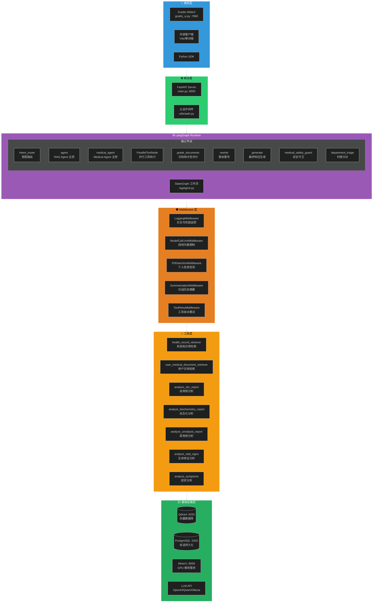

### 1.2 核心设计原则

| 原则 | 说明 | 实现位置 |
|------|------|----------|
| **双路由隔离** | General/Medical Agent 物理隔离，工具集独立 | `ragAgent.py` → `ToolConfig` |
| **无状态 Middleware** | 实例仅存配置，运行时数据存 AgentState | `utils/middleware.py` |
| **可观测性** | 完整的日志追踪、节点耗时统计、LangSmith 集成 | `LoggingMiddleware` + LangSmith |
| **容错性** | 断路器防死循环、重试机制、降级策略 | `ToolConfig` + `ToolRetryMiddleware` |
| **安全性** | PII 检测、user_id 防伪造、工具访问控制 | `auth.py` + `PIIDetectionMiddleware` |

### 1.3 双路由架构详解

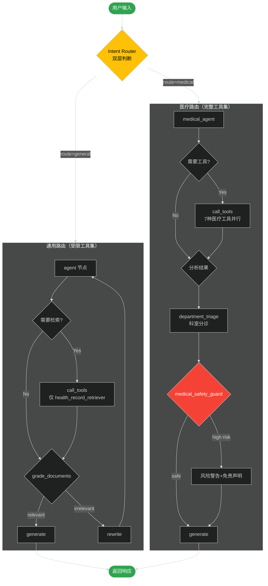

---

## 二、技术选型

### 2.1 技术栈总览

| 层级 | 技术选型 | 版本要求 | 选型理由 |
|------|----------|----------|----------|
| **工作流引擎** | LangGraph | 1.0+ | 灵活的状态图，支持条件路由和循环 |
| **LLM 框架** | LangChain | 1.0+ | 丰富的集成，原生 Tool Calling 支持 |
| **向量数据库** | Qdrant | 1.12+ | 原生混合检索(BM25+Dense)，高性能 |
| **关系数据库** | PostgreSQL | 15+ | langgraph-checkpoint-postgres 持久化 |
| **API 框架** | FastAPI | 0.100+ | 高性能，原生异步，Swagger 自动文档 |
| **Web 前端** | Gradio | 4.0+ | 快速构建 ML 应用界面，内置认证 |
| **文档解析** | MinerU | latest | GPU 加速，高保真 Markdown 输出 |
| **容器编排** | Docker Compose | V2 | 简单易用，适合中小规模部署 |

### 2.2 LLM 提供商支持矩阵

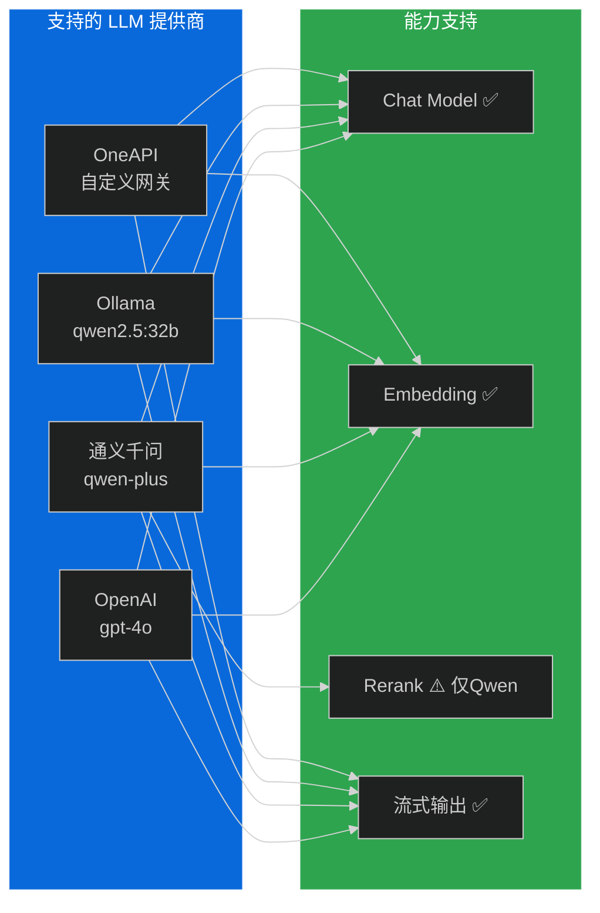

| 提供商 | Chat Model | Embedding | Rerank | 适用场景 |
|--------|------------|-----------|--------|----------|
| `openai` | gpt-4o | text-embedding-3-small | - | 生产环境首选 |
| `qwen` | qwen-plus | text-embedding-v1 | qwen3-rerank | **推荐**，完整链路 |
| `ollama` | qwen2.5:32b | bge-m3:latest | - | 本地离线开发 |
| `oneapi` | qwen-max | 自定义 | - | 企业统一网关 |

---

## 三、模块设计

### 3.1 模块划分

```mermaid
%%{init: {'theme': 'dark'}}%%
flowchart TB
    subgraph Core["核心模块"]
        AGENT[ragAgent.py<br/>LangGraph 编译 + 节点函数]
        PIPE[pipeline.py<br/>文档处理流水线]
        CONFIG[config.py<br/>统一配置兼容层]
    end
    
    subgraph API["API 模块"]
        MAIN[main.py<br/>FastAPI 服务入口]
        GRADIO[gradio_ui.py<br/>Gradio Web 前端]
    end
    
    subgraph Utils["工具模块"]
        LLMS[llms.py<br/>LLM 客户端工厂]
        TOOLS[tools_config.py<br/>工具工厂(物理隔离)]
        RETRIEVER[retriever.py<br/>两阶段混合检索器]
        MW[middleware.py<br/>Middleware 体系(5种)]
        AUTH[auth.py<br/>用户认证(3方式)]
        DOC_PROC[document_processor.py<br/>用户文档处理器]
    end
    
    subgraph ConfigSub["配置子模块 utils/config/"]
        BASE[base_config.py<br/>基础配置 + 组合类]
        LLM_CFG[llm_config.py<br/>LLM 供应商配置]
        VS_CFG[vectorstore_config.py<br/>向量库配置]
        MW_CFG[middleware_config.py<br/>Middleware 配置]
        SVC_CFG[service_config.py<br/>服务配置]
    end
    
    subgraph Medical["医疗分析子模块 utils/medical_analysis/"]
        BASE_ANA[base_analyzer.py<br/>抽象基类]
        CBC[cbc_analyzer.py<br/>血常规(15+指标)]
        BIO[biochemistry_analyzer.py<br/>血生化(20+指标)]
        URINE[urinalysis_analyzer.py<br/>尿常规(10+指标)]
        VS[vital_signs_analyzer.py<br/>生命体征]
        SYMPTOM[symptom_analyzer.py<br/>症状分析]
        MT[medical_tools.py<br/>LangChain Tool 封装]
    end
    
    subgraph Data["数据模块"]
        VS_ENGINE[vectorSave.py<br/>向量存储引擎 v2]
        MC[mineru_client.py<br/>MinerU 客户端]
    end
    
    API --> Core
    Core --> Utils
    Core --> Data
    Utils --> ConfigSub
    Utils --> Medical
    
    style Core fill:#9b59b6,color:#fff
    style API fill:#3498db,color:#fff
    style Utils fill:#2ea44f,color:#000
    style Medical fill:#e67e22,color:#000
    style Data fill:#f39c12,color:#000
```

### 3.2 核心模块详解

#### 3.2.1 ragAgent.py — Agent 核心逻辑

**文件定位**: 整个系统的大脑，包含 LangGraph StateGraph 编排和所有节点函数。

**关键组件:**

```python
class AgentState(MessagesState):
    """
    对话状态定义。
    
    设计要点:
    - 继承 MessagesState 复用消息管理
    - Annotated[int, operator.add] 实现跨节点累加
    - 业务字段和 Middleware 追踪字段清晰分离
    """
    # ===== 业务字段 =====
    relevance_score: Optional[str] = None       # 检索相关性评分 (yes/no)
    rewrite_count: int = 0                       # 查询重写次数（防死循环）
    route_domain: Optional[Literal["general", "medical"]] = None
    route_reason: Optional[str] = None          # 路由原因说明
    
    # 医疗建议字段
    recommended_departments: Optional[List[str]] = None   # 推荐科室列表
    urgency_level: Optional[Literal["routine", "urgent", "emergency"]] = None
    risk_level: Optional[Literal["low","medium","high","critical"]] = None
    final_payload: Optional[dict] = None                # 最终输出载荷
    
    # ===== Middleware 追踪字段 =====
    mw_model_call_count: Annotated[int, operator.add] = 0
    mw_model_total_time: Annotated[float, operator.add] = 0.0
    mw_tool_total_time: Annotated[float, operator.add] = 0.0
    mw_pii_detected: bool = False
    mw_force_stop: bool = False
    mw_node_timings: Optional[dict] = None


class ToolConfig:
    """
    工具配置类 - 实施物理工具隔离。
    
    安全约束:
    - rag_tools: 仅包含 health_record_retriever（1个）
    - medical_tools: 包含完整工具集（7个）
    """


class ParallelToolNode:
    """
    并行工具执行节点。
    
    特性:
    - ThreadPoolExecutor 并行执行多工具调用
    - Middleware before_tool / after_tool 钩子
    - ToolRetryMiddleware 指数退避重试
    - as_completed(timeout=) 超时控制
    """
```

**节点函数一览:**

| 节点函数 | 类型 | 功能 | 关键逻辑 |
|----------|------|------|----------|
| `intent_router()` | 条件路由 | 意图分类 | 关键词预检(30+) → LLM 分类 |
| `agent()` | model | RAG Agent 主控 | 决定是否调用检索工具 |
| `medical_agent()` | model | Medical Agent 主控 | 决定调用哪些医疗工具 |
| `grade_documents()` | model | 文档相关性评分 | yes→生成 / no→重写 |
| `rewrite()` | model | 查询改写优化 | 结合上下文重写查询 |
| `generate()` | model | 最终响应生成 | 基于工具结果生成回复 |
| `ParallelToolNode.__call__()` | tool | 并行工具执行 | ThreadPoolExecutor |
| `medical_safety_guard()` | 条件路由 | 安全守卫 | 风险拦截 + 免责声明 |
| `department_triage()` | 条件路由 | 科室分诊 | 推荐科室 + 紧急度 |

#### 3.2.2 main.py — FastAPI 服务入口

**核心接口:**

| 方法 | 路径 | 功能 | 认证方式 |
|------|------|------|----------|
| GET | `/health` | 健康检查 | 无需认证 |
| POST | `/v1/chat/completions` | 聊天完成 | API Key / JWT / 开发模式 |
| POST | `/v1/documents/upload` | 文档上传 | API Key / JWT |
| GET | `/v1/documents` | 文档列表 | API Key / JWT |
| DELETE | `/v1/documents/{md5}` | 删除文档 | API Key / JWT |
| GET | `/v1/documents/stats` | 文档统计 | API Key / JWT |

**响应格式增强:**
- 流式响应：SSE (text/event-stream)
- 非流式响应：标准 JSON
- **医疗扩展**：仅 medical 路由返回 `medical` 字段（risk_level, disclaimer, structured_data）

#### 3.2.3 utils/middleware.py — Middleware 体系

**五种 Middleware 对比:**

| Middleware 类 | 适用节点类型 | 核心功能 | 可配置项 | 默认值 |
|---------------|-------------|----------|----------|--------|
| `LoggingMiddleware` | model + tool | 日志与性能追踪 | - | - |
| `ModelCallLimitMiddleware` | model | 模型调用次数限制 | `max_calls` | 10 |
| `PIIDetectionMiddleware` | model | PII 个人信息检测 | `mode` (detect/warn/mask/block) | warn |
| `SummarizationMiddleware` | model | 对话历史截断 | `max_messages`, `keep_recent` | 20, 5 |
| `ToolRetryMiddleware` | tool | 工具调用自动重试 | `max_retries`, `backoff_factor` | 2, 0.5 |

**洋葱模型执行顺序:**

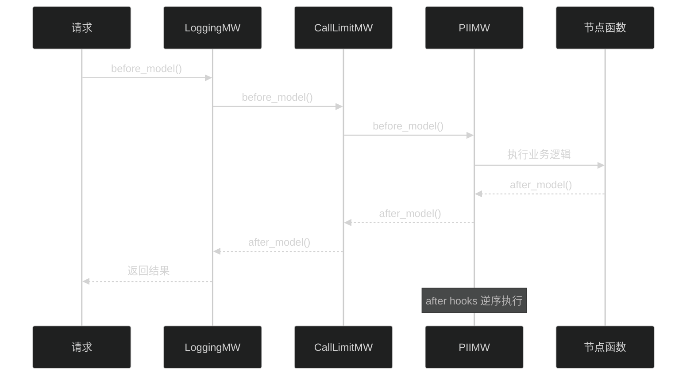

#### 3.2.4 utils/tools_config.py — 工具工厂

**物理隔离策略:**

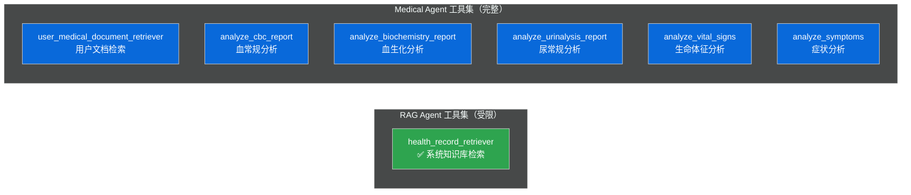

#### 3.2.5 utils/retriever.py — 两阶段混合检索器

**检索流程:**

```
query → [Stage 1: Qdrant Hybrid Search BM25+Dense Top-5] 
      → [Stage 2: DashScope Rerank Top-3] 
      → 最终文档列表
```

#### 3.2.6 utils/auth.py — 认证模块

**认证优先级链:**

```
API Key (X-API-Key Header) → JWT Token (Authorization Bearer) → 开发模式 (userId from body)
```

**安全约束:** user_id 必须从认证体系获取，禁止从请求体直接读取（防止伪造）

### 3.3 医疗分析子模块

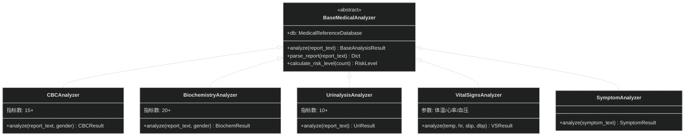

---

## 四、数据流设计

### 4.1 知识库构建流程

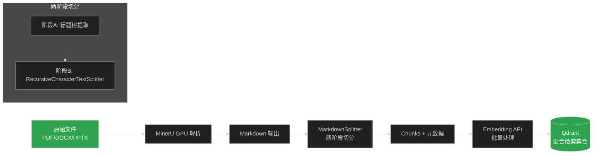

### 4.2 用户文档处理流程


### 4.3 检索流程

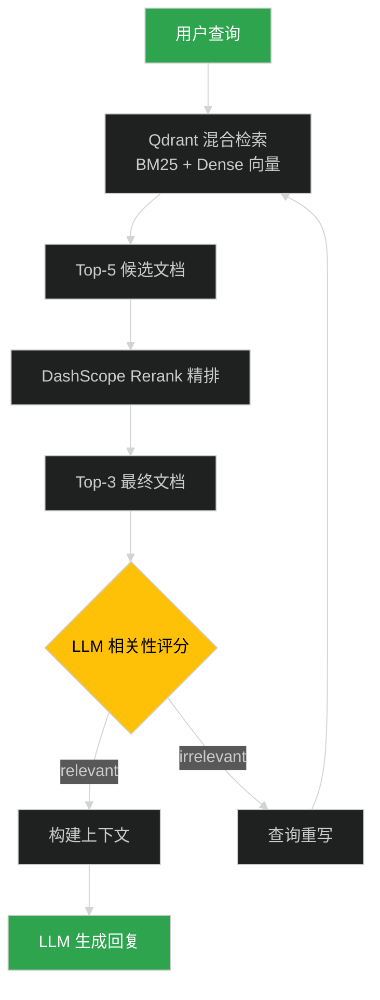

### 4.4 完整请求处理时序

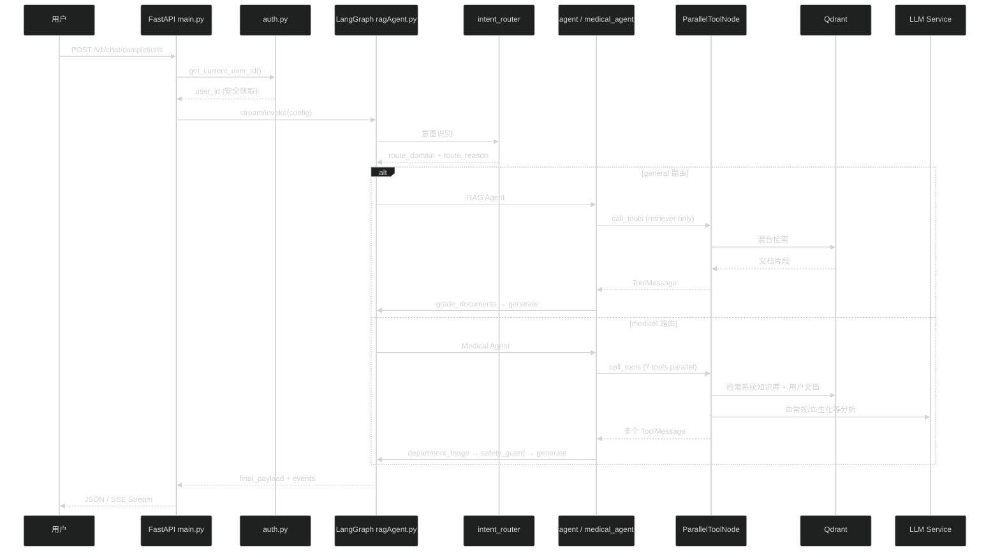

---

## 五、API 设计

### 5.1 接口规范

#### 5.1.1 聊天接口

```yaml
POST /v1/chat/completions
Content-Type: application/json

Headers:
  X-API-Key: string           # 服务间调用认证
  Authorization: Bearer xxx   # 前端用户认证

Request Body:
  messages: array[Message]     # 对话消息列表
  stream: boolean              # 是否流式输出 (默认 false)
  userId: string               # 用户 ID (仅开发模式)
  conversationId: string       # 会话 ID (可选, 默认 default)

Response (非流式):
  id: string                   # 响应唯一标识
  choices: array[Choice]       # 回复选项
  medical: MedicalExtension?   # 医疗扩展信息 (仅 medical 路由)
    risk_level: string         # low/medium/high/critical
    risk_warning: string       # 风险警告文本
    disclaimer: string         # 免责声明
    structured_data: object?   # 结构化医疗数据
      recommended_departments: string[]
      urgency_level: string    # routine/urgent/emergency
      triage_confidence: float # 分诊置信度 0.0~1.0
```

#### 5.1.2 文档管理接口

```yaml
POST /v1/documents/upload
  上传用户医疗文档
  Form: file, doc_type(blood_report/biochemical/urinalysis/vital_signs/other)
  
GET /v1/documents?limit=10&offset=0
  获取当前用户的文档列表
  
DELETE /v1/documents/{file_md5}
  按 MD5 删除指定文档
  
GET /v1/documents/stats
  获取文档统计信息 (总数/各类型数量/总大小)
```

### 5.2 错误码规范

| HTTP 状态码 | 错误码 | 说明 |
|-------------|--------|------|
| 400 | INVALID_REQUEST | 请求参数无效 |
| 401 | AUTHENTICATION_ERROR | 认证失败 |
| 403 | FORBIDDEN | 权限不足 |
| 404 | DOCUMENT_NOT_FOUND | 文档不存在 |
| 429 | RATE_LIMIT_EXCEEDED | 频率限制 |
| 500 | INTERNAL_ERROR | 内部服务器错误 |
| 503 | MODEL_OVERLOADED | LLM 服务过载 |

---

## 六、部署架构

### 6.1 单机部署架构

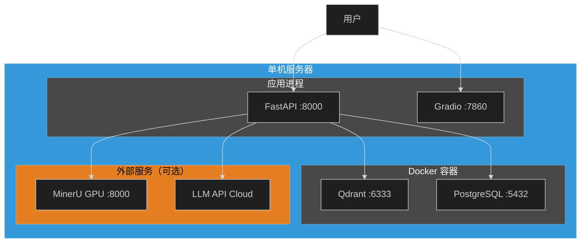

### 6.2 分布式部署架构

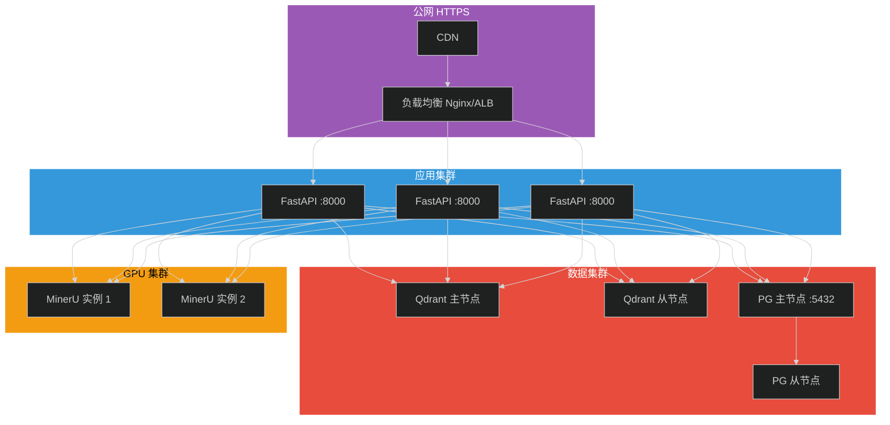

### 6.3 端口规划

| 服务 | 端口 | 协议 | 说明 |
|------|------|------|------|
| FastAPI | 8000 | HTTP | RESTful API 服务 |
| Gradio | 7860 | HTTP | Web UI 界面 |
| Qdrant HTTP | 6333 | HTTP | 向量数据库 API |
| Qdrant gRPC | 6334 | gRPC | 向量数据库内部通信 |
| PostgreSQL | 5432 | TCP | 会话持久化存储 |
| MinerU | 8000 | HTTP | GPU 文档解析服务 |

---

## 七、扩展性设计

### 7.1 水平扩展策略

| 组件 | 扩展方式 | 无状态？ | 说明 |
|------|----------|----------|------|
| FastAPI | 多实例负载均衡 | ✅ | 可任意水平扩展 |
| Gradio | Session Sticky | ❌ | 需要 Session 保持 |
| Qdrant | 分片集群 | - | 按集合分片 |
| PostgreSQL | 读写分离 | - | 主从复制 |
| MinerU | 多实例 + 负载均衡 | - | GPU 任务分发 |

### 7.2 扩展点设计

```python
# ===== 工具扩展点 =====
# 在 utils/tools_config.py 中添加新工具工厂方法
def get_custom_tools(llm_embedding) -> List[BaseTool]:
    """自定义工具集合"""
    pass

# ===== Middleware 扩展点 =====
# 继承 BaseMiddleware 实现自定义中间件
class CustomMiddleware(BaseMiddleware):
    applicable_node_types = {"model"}
    
    def before_model(self, state, node_name) -> Tuple[dict, bool]:
        return {}, False
    
    def after_model(self, state, response, node_name, elapsed) -> dict:
        return {}

# ===== 分析器扩展点 =====
# 继承 BaseMedicalAnalyzer 添加新的医学分析器
class CustomAnalyzer(BaseMedicalAnalyzer):
    def get_analysis_type(self) -> AnalysisType:
        return AnalysisType.CUSTOM
```

### 7.3 新增医疗分析器步骤

```mermaid
%%{init: {'theme': 'dark'}}%%
flowchart LR
    A[1. 创建 analyzer_xxx.py] --> B[2. 继承 BaseMedicalAnalyzer]
    B --> C[3. 实现 analyze() 方法]
    C --> D[4. 定义参考范围 MedicalReferenceDatabase]
    D --> E[5. 在 medical_tools.py 注册 @tool]
    E --> F[6. 在 tools_config.py 添加到 medical_tools]
    F --> G[7. 更新 prompt_template_medical_agent.txt]
```

---

## 附录

### A. 配置项速查表

| 配置项 | 环境变量 | 默认值 | 说明 |
|--------|----------|--------|------|
| LLM 类型 | `LLM_TYPE` | `qwen` | LLM 供应商 |
| 通义千问 Key | `DASHSCOPE_API_KEY` | - | 阿里百炼 API Key |
| OpenAI Key | `OPENAI_API_KEY` | - | OpenAI API Key |
| Qdrant URL | `QDRANT_URL` | `http://127.0.0.1:6333` | 向量库地址 |
| 集合名 | `QDRANT_COLLECTION_NAME` | `knowledge_base_v2` | Qdrant 集合名称 |
| MinerU 地址 | `MINERU_API_URL` | `http://localhost:8000` | 解析服务地址 |
| DB 连接串 | `DB_URI` | - | PostgreSQL 连接 |
| 最大模型调用 | `MW_MAX_MODEL_CALLS` | `10` | 单次对话上限 |
| PII 模式 | `MW_PII_MODE` | `warn` | detect/warn/mask/block |
| 并行线程数 | `PARALLEL_TOOL_MAX_WORKERS` | `5` | 工具并行数 |
| 工具超时 | `PARALLEL_TOOL_TIMEOUT` | `30` | 秒 |

### B. 目录结构速查

```
L1-Project-2/
├── 📄 核心入口
│   ├── main.py              # FastAPI (681行)
│   ├── ragAgent.py          # LangGraph 编译 (1200+行)
│   ├── vectorSave.py        # 向量引擎 v2
│   ├── pipeline.py          # 文档流水线
│   └── gradio_ui.py         # Web 前端
│
├── 📁 utils/
│   ├── llms.py              # LLM 工厂 (4供应商)
│   ├── tools_config.py      # 工具工厂 (物理隔离)
│   ├── retriever.py         # 两阶段检索
│   ├── middleware.py         # 5 种 Middleware
│   ├── auth.py              # 3 方式认证
│   │
│   ├── config/              # 6 个配置子模块
│   └── medical_analysis/    # 5 个分析器 + Tool 封装
│
├── 📁 prompts/              # 7 个提示词模板
├── 📁 test/                 # 测试用例
├── 📁 docker-compose/       # 3 个编排文件
└── 📋 requirements.txt      # Python 依赖
```

---

**文档版本**: v2.0.0 | **更新日期**: 2026-04-19 | **维护者**: 开发团队
