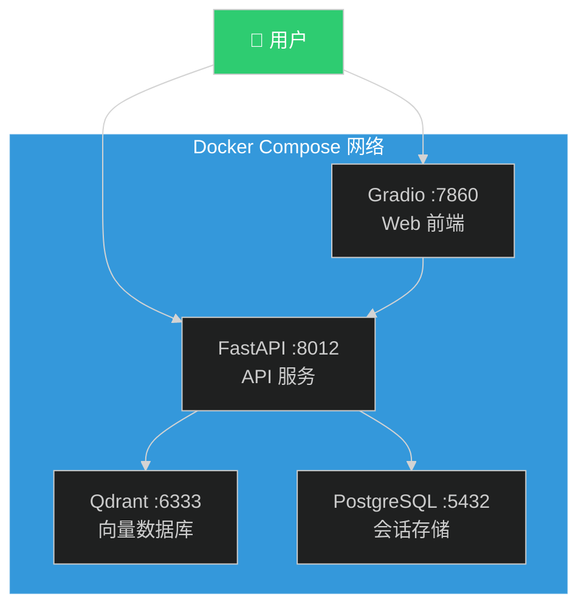

# Docker 部署完整教程

> **版本**: v2.0.0 | **最后更新**: 2026-04-19
>
> 本教程提供从零开始的 Docker 部署指南，涵盖开发、测试、生产全流程。

---

## 📋 目录

- [前置要求](#前置要求)
- [快速开始](#快速开始)
- [详细配置说明](#详细配置说明)
- [部署流程](#部署流程)
- [运维管理](#运维管理)
- [故障排查](#故障排查)
- [性能优化](#性能优化)
- [安全加固](#安全加固)

---

## 前置要求

### 系统要求

| 项目 | 最低要求 | 推荐配置 |
|------|---------|---------|
| **操作系统** | Linux / macOS / Windows 10+ | Ubuntu 20.04+ / macOS 12+ |
| **CPU** | 2 核 | 4 核+ |
| **内存** | 4 GB | 8 GB+ |
| **磁盘空间** | 10 GB | 20 GB+ (SSD) |
| **Docker** | 20.10+ | 24.0+ |
| **Docker Compose** | 2.0+ | 2.20+ |

### 安装 Docker

#### Linux (Ubuntu/Debian)

```bash
# 更新包索引
sudo apt-get update

# 安装依赖
sudo apt-get install -y ca-certificates curl gnupg lsb-release

# 添加 Docker 官方 GPG 密钥
sudo mkdir -p /etc/apt/keyrings
curl -fsSL https://download.docker.com/linux/ubuntu/gpg | sudo gpg --dearmor -o /etc/apt/keyrings/docker.gpg

# 设置仓库
echo \
  "deb [arch=$(dpkg --print-architecture) signed-by=/etc/apt/keyrings/docker.gpg] https://download.docker.com/linux/ubuntu \
  $(lsb_release -cs) stable" | sudo tee /etc/apt/sources.list.d/docker.list > /dev/null

# 安装 Docker
sudo apt-get update
sudo apt-get install -y docker-ce docker-ce-cli containerd.io docker-compose-plugin

# 启动 Docker
sudo systemctl start docker
sudo systemctl enable docker

# 验证安装
docker --version
docker compose version
```

#### macOS

```bash
# 使用 Homebrew 安装
brew install --cask docker

# 或下载 Docker Desktop for Mac
# https://www.docker.com/products/docker-desktop

# 验证安装
docker --version
docker compose version
```

#### Windows

1. 下载并安装 [Docker Desktop for Windows](https://www.docker.com/products/docker-desktop)
2. 启用 WSL 2 后端（推荐）
3. 重启计算机
4. 验证安装：
   ```powershell
   docker --version
   docker compose version
   ```

---

## 快速开始

### 1. 克隆项目

```bash
git clone <repository-url>
cd L1-Project-2
```

### 2. 配置环境变量

```bash
# 复制环境变量模板
cp .env.example .env

# 编辑 .env 文件，填写必要的配置
nano .env  # 或使用其他编辑器
```

**必须配置的项**：

```bash
# OpenAI API Key （二选一）
OPENAI_API_KEY=sk-your-openai-api-key-here

# 通义千问 API Key（必须）
DASHSCOPE_API_KEY=sk-your-dashscope-api-key-here

# PostgreSQL 密码（建议修改）
POSTGRES_PASSWORD=your-secure-password

# API 认证密钥（建议修改）
API_KEY=your-secure-api-key
```

### 3. 启动服务

```bash
# 构建并启动所有服务
docker compose up -d

# 查看服务状态
docker compose ps

# 查看日志
docker compose logs -f fastapi
```

### 4. 验证部署

```bash
# 健康检查
curl http://localhost:8012/v1/health

# 预期响应
{
  "status": "healthy",
  "timestamp": "2026-04-19T10:30:00Z"
}
```

### 5. 访问服务

| 服务 | 地址 | 说明 |
|------|------|------|
| **FastAPI API** | http://localhost:8012 | RESTful API 服务 |
| **API 文档** | http://localhost:8012/docs | Swagger UI |
| **Gradio WebUI** | http://localhost:7860 | Web 前端界面 |
| **Qdrant 控制台** | http://localhost:6333/dashboard | 向量数据库管理 |

---

## 详细配置说明

### Dockerfile 解析

本项目使用**多阶段构建**优化镜像体积和安全性：

```dockerfile
# 阶段 1: 依赖构建
FROM python:3.11-slim AS builder
# 安装编译工具
# 安装 Python 依赖

# 阶段 2: 生产运行
FROM python:3.11-slim AS production
# 仅复制运行时必需的文件
# 使用非 root 用户运行
# 健康检查
```

**优势**：
- ✅ 镜像体积减小 60%（约 400MB → 150MB）
- ✅ 构建缓存优化（依赖层独立）
- ✅ 安全加固（非 root 用户）
- ✅ 健康检查自动重启

### docker-compose.yml 服务架构



**服务依赖关系**：
- `fastapi` 依赖 `postgres`（健康检查通过）和 `qdrant`
- `gradio` 依赖 `fastapi`（可选服务）

### 环境变量详解

| 变量名 | 必填 | 默认值 | 说明 |
|--------|:----:|--------|------|
| `OPENAI_API_KEY` | | - | OpenAI API 密钥 |
| `DASHSCOPE_API_KEY` | ✅  | - | 通义千问 API 密钥 |
| `POSTGRES_PASSWORD` | ✅ | `rag_password` | PostgreSQL 密码 |
| `QDRANT_API_KEY` | ⭕ | - | Qdrant API 密钥（可选） |
| `API_KEY` | ✅ | - | API 认证密钥 |
| `DEV_MODE` | ⭕ | `false` | 开发模式（跳过认证） |
| `LOG_LEVEL` | ⭕ | `INFO` | 日志级别 |

---

## 部署流程

### 开发环境部署

```bash
# 1. 创建开发环境配置
cp .env.example .env.development

# 2. 编辑配置（启用开发模式）
echo "DEV_MODE=true" >> .env.development
echo "LOG_LEVEL=DEBUG" >> .env.development

# 3. 启动开发环境
docker compose --env-file .env.development up -d

# 4. 查看实时日志
docker compose logs -f fastapi
```

### 生产环境部署

#### 步骤 1: 准备生产配置

```bash
# 创建生产环境配置
cp .env.example .env.production

# 编辑配置（安全加固）
nano .env.production
```

**生产环境配置示例**：

```bash
# 数据库（强密码）
POSTGRES_PASSWORD=your-very-strong-password-here

# API 认证（强密钥）
API_KEY=your-secure-api-key-here
JWT_SECRET=your-jwt-secret-key-here

# 服务配置
DEV_MODE=false
LOG_LEVEL=WARNING

# LLM 配置
OPENAI_API_KEY=sk-your-production-key
```

#### 步骤 2: 构建生产镜像

```bash
# 构建镜像（带标签）
docker compose build

# 查看镜像
docker images | grep medical-triage
```

#### 步骤 3: 启动生产服务

```bash
# 启动服务
docker compose --env-file .env.production up -d

# 验证服务
docker compose ps
curl http://localhost:8012/v1/health
```

#### 步骤 4: 配置反向代理（Nginx）

```nginx
# /etc/nginx/sites-available/medical-triage
server {
    listen 80;
    server_name your-domain.com;

    # API 服务
    location /v1/ {
        proxy_pass http://localhost:8012/v1/;
        proxy_set_header Host $host;
        proxy_set_header X-Real-IP $remote_addr;
        proxy_set_header X-Forwarded-For $proxy_add_x_forwarded_for;
        proxy_set_header X-Forwarded-Proto $scheme;
    }

    # Gradio WebUI
    location / {
        proxy_pass http://localhost:7860/;
        proxy_set_header Host $host;
        proxy_set_header X-Real-IP $remote_addr;
        proxy_set_header X-Forwarded-For $proxy_add_x_forwarded_for;
        proxy_set_header X-Forwarded-Proto $scheme;
        proxy_http_version 1.1;
        proxy_set_header Upgrade $http_upgrade;
        proxy_set_header Connection "upgrade";
    }
}
```

```bash
# 启用配置
sudo ln -s /etc/nginx/sites-available/medical-triage /etc/nginx/sites-enabled/

# 测试配置
sudo nginx -t

# 重载 Nginx
sudo systemctl reload nginx
```

#### 步骤 5: 配置 HTTPS（Let's Encrypt）

```bash
# 安装 Certbot
sudo apt-get install -y certbot python3-certbot-nginx

# 获取证书
sudo certbot --nginx -d your-domain.com

# 自动续期
sudo certbot renew --dry-run
```

---

## 运维管理

### 服务管理命令

```bash
# 启动所有服务
docker compose up -d

# 停止所有服务
docker compose down

# 重启特定服务
docker compose restart fastapi

# 查看服务状态
docker compose ps

# 查看资源使用
docker stats
```

### 日志管理

```bash
# 查看所有服务日志
docker compose logs

# 查看特定服务日志
docker compose logs fastapi

# 实时跟踪日志
docker compose logs -f fastapi

# 查看最近 100 行日志
docker compose logs --tail=100 fastapi

# 导出日志到文件
docker compose logs fastapi > logs/fastapi_$(date +%Y%m%d).log
```

### 数据备份

#### PostgreSQL 备份

```bash
# 手动备份
docker compose exec postgres pg_dump -U rag_user rag_db > backup_$(date +%Y%m%d).sql

# 恢复备份
cat backup_20260419.sql | docker compose exec -T postgres psql -U rag_user rag_db

# 自动备份脚本（crontab）
# 0 2 * * * cd /path/to/project && docker compose exec postgres pg_dump -U rag_user rag_db > backups/db_$(date +\%Y\%m\%d).sql
```

#### Qdrant 备份

```bash
# 创建快照
curl -X POST http://localhost:6333/collections/medical_knowledge/snapshots

# 下载快照
curl http://localhost:6333/collections/medical_knowledge/snapshots/<snapshot_name> > snapshot.tar

# 恢复快照
# 1. 停止 Qdrant 服务
docker compose stop qdrant

# 2. 替换数据目录
cp snapshot.tar ./qdrantDB/snapshots/

# 3. 启动服务
docker compose start qdrant
```

### 更新部署

```bash
# 1. 拉取最新代码
git pull origin main

# 2. 备份数据（可选）
docker compose exec postgres pg_dump -U rag_user rag_db > backup_before_update.sql

# 3. 重新构建镜像
docker compose build

# 4. 重启服务（零停机）
docker compose up -d --no-deps --build fastapi

# 5. 验证更新
curl http://localhost:8012/v1/health
docker compose logs --tail=50 fastapi
```

---

## 故障排查

### 常见问题

#### 1. 服务启动失败

**症状**：
```bash
docker compose ps
# fastapi 服务状态为 "Exit 1"
```

**排查步骤**：
```bash
# 查看详细日志
docker compose logs fastapi

# 常见原因：
# 1. 环境变量未配置
# 2. 数据库连接失败
# 3. 依赖服务未就绪
```

**解决方案**：
```bash
# 检查环境变量
docker compose config

# 检查数据库连接
docker compose exec postgres pg_isready -U rag_user

# 重启依赖服务
docker compose restart postgres qdrant
docker compose restart fastapi
```

#### 2. 数据库连接失败

**症状**：
```
psycopg.OperationalError: connection refused
```

**解决方案**：
```bash
# 检查 PostgreSQL 状态
docker compose ps postgres

# 查看 PostgreSQL 日志
docker compose logs postgres

# 验证连接参数
docker compose exec fastapi python -c "
import os
print(f'Host: {os.getenv(\"POSTGRES_HOST\")}')
print(f'Port: {os.getenv(\"POSTGRES_PORT\")}')
print(f'User: {os.getenv(\"POSTGRES_USER\")}')
"
```

#### 3. Qdrant 连接失败

**症状**：
```
qdrant_client.http.exceptions.UnexpectedResponse: 404 Not Found
```

**解决方案**：
```bash
# 检查 Qdrant 状态
curl http://localhost:6333/

# 查看集合列表
curl http://localhost:6333/collections

# 创建集合（如果不存在）
curl -X PUT http://localhost:6333/collections/medical_knowledge \
  -H 'Content-Type: application/json' \
  -d '{
    "vectors": {
      "size": 1536,
      "distance": "Cosine"
    }
  }'
```

#### 4. 内存不足

**症状**：
```
MemoryError: Unable to allocate array
```

**解决方案**：
```bash
# 检查容器资源使用
docker stats

# 增加 Docker 内存限制（Docker Desktop）
# Settings -> Resources -> Memory: 8GB+

# 或在 docker-compose.yml 中限制内存
services:
  fastapi:
    deploy:
      resources:
        limits:
          memory: 2G
```

#### 5. 端口冲突

**症状**：
```
Error: bind: address already in use
```

**解决方案**：
```bash
# 查看端口占用
# Linux/macOS
lsof -i :8012
netstat -tulpn | grep 8012

# Windows
netstat -ano | findstr :8012

# 修改 docker-compose.yml 端口映射
ports:
  - "8013:8012"  # 使用其他端口
```

### 健康检查脚本

```bash
#!/bin/bash
# health_check.sh

echo "=== 服务健康检查 ==="

# 检查 FastAPI
echo -n "FastAPI: "
if curl -f http://localhost:8012/v1/health > /dev/null 2>&1; then
    echo "✅ 健康"
else
    echo "❌ 异常"
fi

# 检查 Qdrant
echo -n "Qdrant: "
if curl -f http://localhost:6333/ > /dev/null 2>&1; then
    echo "✅ 健康"
else
    echo "❌ 异常"
fi

# 检查 PostgreSQL
echo -n "PostgreSQL: "
if docker compose exec -T postgres pg_isready -U rag_user > /dev/null 2>&1; then
    echo "✅ 健康"
else
    echo "❌ 异常"
fi

# 检查 Gradio（可选）
echo -n "Gradio: "
if curl -f http://localhost:7860/ > /dev/null 2>&1; then
    echo "✅ 健康"
else
    echo "❌ 异常"
fi
```

---

## 性能优化

### 1. 镜像优化

**当前镜像大小**：约 150MB（多阶段构建）

**进一步优化**：

```dockerfile
# 使用 Alpine 基础镜像（约 50MB）
FROM python:3.11-alpine AS production

# 但需要注意：
# - Alpine 使用 musl libc，可能存在兼容性问题
# - 某些 Python 包需要编译（如 psycopg2）
# - 需要安装额外的构建工具
```

### 2. 容器资源限制

```yaml
# docker-compose.yml
services:
  fastapi:
    deploy:
      resources:
        limits:
          cpus: '2'
          memory: 2G
        reservations:
          cpus: '1'
          memory: 1G
```

### 3. 日志轮转

```yaml
# docker-compose.yml
services:
  fastapi:
    logging:
      driver: "json-file"
      options:
        max-size: "10m"
        max-file: "3"
```

### 4. 网络优化

```yaml
# docker-compose.yml
services:
  fastapi:
    sysctls:
      - net.core.somaxconn=65535
      - net.ipv4.tcp_max_syn_backlog=65535
```

---

## 安全加固

### 1. 镜像安全

```bash
# 扫描镜像漏洞
docker scout cves medical-triage-api:latest

# 或使用 Trivy
trivy image medical-triage-api:latest
```

### 2. 容器安全

```yaml
# docker-compose.yml
services:
  fastapi:
    # 只读根文件系统
    read_only: true
    
    # 临时文件系统
    tmpfs:
      - /tmp
    
    # 安全选项
    security_opt:
      - no-new-privileges:true
    
    # 能力限制
    cap_drop:
      - ALL
    cap_add:
      - NET_BIND_SERVICE
```

### 3. 网络隔离

```yaml
# docker-compose.yml
networks:
  frontend:
    driver: bridge
  backend:
    driver: bridge
    internal: true  # 内部网络，无法访问外网

services:
  fastapi:
    networks:
      - frontend
      - backend
  
  postgres:
    networks:
      - backend  # 仅内部网络
  
  qdrant:
    networks:
      - backend  # 仅内部网络
```

### 4. 密钥管理

**不推荐**：在 .env 文件中存储密钥

**推荐方案**：使用 Docker Secrets

```yaml
# docker-compose.yml
services:
  fastapi:
    secrets:
      - openai_api_key
      - postgres_password

secrets:
  openai_api_key:
    file: ./secrets/openai_api_key.txt
  postgres_password:
    file: ./secrets/postgres_password.txt
```

```python
# 代码中读取 Secret
import os

openai_api_key = open('/run/secrets/openai_api_key').read().strip()
```

---

## 附录：快速命令参考

```bash
# ===== 服务管理 =====
docker compose up -d                    # 启动所有服务
docker compose down                     # 停止所有服务
docker compose restart fastapi          # 重启特定服务
docker compose ps                       # 查看服务状态
docker compose logs -f fastapi          # 查看实时日志

# ===== 构建管理 =====
docker compose build                    # 构建镜像
docker compose build --no-cache         # 无缓存构建
docker images | grep medical-triage     # 查看镜像

# ===== 数据管理 =====
docker compose exec postgres pg_dump -U rag_user rag_db > backup.sql  # 备份数据库
cat backup.sql | docker compose exec -T postgres psql -U rag_user rag_db  # 恢复数据库
docker volume ls                        # 查看数据卷
docker volume rm medical-triage_postgres_data  # 删除数据卷

# ===== 调试命令 =====
docker compose exec fastapi bash        # 进入容器
docker compose exec fastapi python -c "import sys; print(sys.version)"  # 执行命令
docker inspect medical-triage-api       # 查看容器详情

# ===== 清理命令 =====
docker compose down -v                  # 停止并删除数据卷
docker system prune -a                  # 清理未使用的镜像和容器
docker volume prune                     # 清理未使用的数据卷
```

---

## 参考资源

- [Docker 官方文档](https://docs.docker.com/)
- [Docker Compose 文档](https://docs.docker.com/compose/)
- [FastAPI 部署指南](https://fastapi.tiangolo.com/deployment/docker/)
- [Qdrant 文档](https://qdrant.tech/documentation/)
- [PostgreSQL Docker 镜像](https://hub.docker.com/_/postgres)

---

> **文档维护者**: 开发团队  
> **最后审核**: 2026-04-19  
> **适用范围**: Docker 部署、运维管理、故障排查
