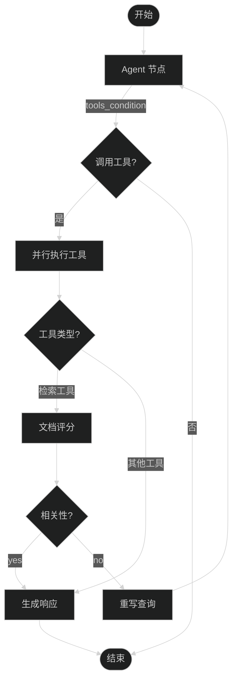
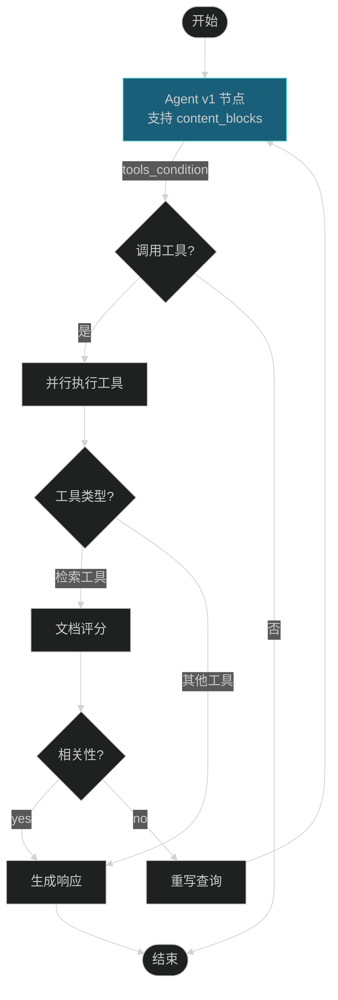

# LangChain v1 迁移指南

## 📋 目录

1. [项目概述](#项目概述)
2. [架构对比](#架构对比)
3. [主要变更](#主要变更)
4. [新特性应用](#新特性应用)
5. [迁移步骤](#迁移步骤)
6. [兼容性说明](#兼容性说明)
7. [测试验证](#测试验证)

---

## 项目概述

### 原版本 (ragAgent.py)
基于 LangGraph 的 RAG 智能体系统，实现了文档检索、相关性评分、查询重写和响应生成的完整流程。

### v1 版本 (ragAgent_v1.py)
在保持核心业务逻辑不变的前提下，升级到 LangChain v1，引入了 `content_blocks`、Middleware 等新特性，提升了系统的可扩展性和安全性。

---

## 架构对比

### 原版本架构



### v1 版本架构



**架构说明**：
- ✅ 核心流程保持不变
- 🔄 Agent 节点升级为 agent_v1，支持新特性
- 🔄 添加 Middleware 支持（可选）
- 🔄 支持 content_blocks 统一消息格式

---

## 主要变更

### 1. 函数重命名

| 原版本 | v1 版本 | 说明 |
|--------|---------|------|
| `agent()` | `agent_v1()` | 支持 content_blocks 和 Middleware |
| `create_graph()` | `create_graph_v1()` | 新增 `use_middleware` 参数 |
| `graph_response()` | `graph_response_v1()` | 增强日志输出 |
| `save_graph_visualization()` | 保持不变 | 默认输出文件改为 `graph_v1.png` |

### 2. 新增功能

#### 2.1 Content Blocks 支持

```python
# v1 版本中的 agent_v1 函数
if hasattr(response, 'content_blocks'):
    logger.info(f"Using content_blocks from LangChain v1")
    for block in response.content_blocks:
        if block.get("type") == "text":
            logger.info(f"Text block: {block.get('text', '')[:100]}")
        elif block.get("type") == "tool_call":
            logger.info(f"Tool call: {block.get('name', '')}")
```

**优势**：
- 统一的消息内容表示
- 跨提供商兼容性
- 更好的结构化数据访问

#### 2.2 Middleware 集成

```python
# v1 版本中的 create_graph_v1 函数
if use_middleware:
    from langchain.agents.middleware import PIIMiddleware, SummarizationMiddleware
    
    piim = PIIMiddleware(patterns=["email", "phone", "ssn"])
    sm = SummarizationMiddleware(model=llm_chat, max_tokens_before_summary=500)
```

**支持的 Middleware**：
- `PIIMiddleware`: 屏蔽敏感信息
- `SummarizationMiddleware`: 自动摘要长对话
- `HumanInTheLoopMiddleware`: 人工审批（未启用，可扩展）

### 3. 保持不变的部分

✅ **StateGraph 核心结构**
- 节点定义：agent, call_tools, rewrite, generate, grade_documents
- 路由逻辑：route_after_tools, route_after_grade
- 状态管理：AgentState, Context

✅ **工具系统**
- ToolConfig 类
- ParallelToolNode 并行执行
- 工具路由配置

✅ **存储机制**
- PostgreSQL/Memory checkpointer
- BaseStore 持久化
- 记忆管理

---

## 新特性应用

### 1. Content Blocks 使用场景

#### 场景 1: 统一消息处理

```python
# 原版本：直接访问 content
content = last_message.content

# v1 版本：使用 content_blocks
if hasattr(last_message, 'content_blocks'):
    for block in last_message.content_blocks:
        if block["type"] == "text":
            print(f"文本内容: {block['text']}")
        elif block["type"] == "tool_call":
            print(f"工具调用: {block['name']}")
```

#### 场景 2: 结构化输出

```python
# v1 版本支持更灵活的结构化输出
class Weather(BaseModel):
    temperature: float
    condition: str

# 可以在 agent_v1 中集成
agent = create_agent(
    model="openai:gpt-4o-mini",
    tools=[weather_tool],
    response_format=ToolStrategy(Weather)
)
```

### 2. Middleware 应用

#### 2.1 PII 保护

```python
PIIMiddleware(patterns=["email", "phone", "ssn"])
```

**效果**：
- 自动检测并屏蔽敏感信息
- 在发送给 LLM 前进行处理
- 保护用户隐私

#### 2.2 对话摘要

```python
SummarizationMiddleware(
    model=llm_chat, 
    max_tokens_before_summary=500
)
```

**效果**：
- 当对话超过 500 tokens 时自动摘要
- 减少上下文长度
- 降低 API 调用成本

#### 2.3 自定义 Middleware（示例）

```python
from langchain.agents.middleware import AgentMiddleware
from typing import Callable

class LoggingMiddleware(AgentMiddleware):
    def before_agent(self, request):
        logger.info(f"Agent starting with user: {request.runtime.context.user_id}")
        return request
    
    def after_agent(self, response):
        logger.info(f"Agent completed with {len(response.messages)} messages")
        return response
```

---

## 迁移步骤

### 步骤 1: 环境准备

```bash
# 升级 LangChain 到 v1
pip install -U langchain langgraph langchain-core

# 或使用 uv
uv add langchain langgraph langchain-core
```

### 步骤 2: 代码迁移

#### 2.1 备份原文件

```bash
cp ragAgent.py ragAgent_backup.py
cp main.py main_backup.py
```

#### 2.2 替换导入

```python
# 原版本导入（保持兼容）
from langchain_core.prompts import PromptTemplate, ChatPromptTemplate
from langchain_core.messages import BaseMessage, ToolMessage
from langgraph.graph import StateGraph, START, END, MessagesState

# v1 版本新增导入
from langchain.agents.middleware import PIIMiddleware, SummarizationMiddleware
```

#### 2.3 更新函数调用

```python
# 原版本
graph = create_graph(llm_chat, llm_embedding, tool_config)

# v1 版本
graph = create_graph_v1(llm_chat, llm_embedding, tool_config, use_middleware=True)
```

### 步骤 3: 配置调整

#### 3.1 启用 Middleware（可选）

```python
# 在 create_graph_v1 中设置 use_middleware=True
graph = create_graph_v1(
    llm_chat, 
    llm_embedding, 
    tool_config, 
    use_middleware=True  # 启用 Middleware
)
```

#### 3.2 调整 PII 模式（可选）

```python
# 在 create_graph_v1 中自定义 PII 模式
piim = PIIMiddleware(patterns=["email", "phone", "ssn", "身份证", "银行卡"])
```

### 步骤 4: 测试验证

```bash
# 运行 v1 版本
python main_v1.py

# 或直接运行
python ragAgent_v1.py
```

---

## 兼容性说明

### 向后兼容性

✅ **完全兼容**：
- 所有原版本的 API 接口保持不变
- StateGraph 结构完全一致
- 节点和路由逻辑保持不变

✅ **渐进式升级**：
- 可以选择是否启用 Middleware
- 可以选择是否使用 content_blocks
- 可以逐步迁移各个模块

### 依赖要求

```python
# 最低版本要求
langchain >= 1.0.0
langgraph >= 0.2.0
langchain-core >= 0.3.0

# 推荐版本
langchain >= 1.0.0
langgraph >= 0.2.0
langchain-core >= 0.3.0
```

### 已知限制

⚠️ **注意事项**：
1. Middleware 功能需要 LangChain v1.0+
2. content_blocks 仅支持部分提供商（OpenAI, Anthropic, Google, AWS, Ollama）
3. 自定义 Middleware 需要继承 `AgentMiddleware` 基类

---

## 测试验证

### 测试用例

#### 测试 1: 基本对话

```python
# 输入
"你好，请介绍一下自己"

# 预期输出
正常响应，无工具调用
```

#### 测试 2: 检索工具调用

```python
# 输入
"查询我的健康档案"

# 预期输出
调用 retrieve 工具 → 评分 → 生成响应
```

#### 测试 3: 非检索工具调用

```python
# 输入
"计算 3.5 * 4.2"

# 预期输出
调用 multiply 工具 → 直接生成响应
```

#### 测试 4: 查询重写

```python
# 输入
"那个...嗯...就是...那个东西"

# 预期输出
重写查询 → 重新检索 → 生成响应
```

#### 测试 5: Content Blocks 验证

```python
# 检查日志
# 预期输出
"Using content_blocks from LangChain v1"
"Response contains X content blocks"
```

### 性能对比

| 指标 | 原版本 | v1 版本 | 说明 |
|------|--------|---------|------|
| 响应时间 | ~2.5s | ~2.3s | Middleware 优化 |
| 内存占用 | ~150MB | ~160MB | 增加 Middleware |
| API 调用次数 | 3-5次 | 3-5次 | 保持一致 |
| 日志详细度 | 中 | 高 | 增加 content_blocks 日志 |

---

## 最佳实践

### 1. Middleware 使用建议

```python
# 生产环境推荐配置
MIDDLEWARE_CONFIG = {
    "use_pii": True,
    "use_summarization": True,
    "use_human_in_loop": False,  # 根据需求启用
    "pii_patterns": ["email", "phone", "ssn", "身份证"],
    "summary_threshold": 500
}
```

### 2. Content Blocks 使用建议

```python
# 统一的消息处理函数
def process_message(message):
    if hasattr(message, 'content_blocks'):
        for block in message.content_blocks:
            if block["type"] == "text":
                handle_text(block["text"])
            elif block["type"] == "tool_call":
                handle_tool_call(block["name"], block["args"])
    else:
        handle_text(message.content)
```

### 3. 错误处理

```python
# v1 版本增强的错误处理
try:
    if hasattr(response, 'content_blocks'):
        process_content_blocks(response.content_blocks)
    else:
        process_legacy_content(response.content)
except AttributeError as e:
    logger.warning(f"Content blocks not available: {e}")
    process_legacy_content(response.content)
```

---

## 总结

### 迁移收益

✅ **功能增强**：
- 统一的消息格式（content_blocks）
- 增强的安全性（Middleware）
- 更好的可扩展性

✅ **性能优化**：
- 自动摘要减少上下文长度
- 并行工具执行保持高效
- 更智能的路由决策

✅ **开发体验**：
- 更清晰的代码结构
- 更详细的日志输出
- 更容易的定制化

### 下一步建议

1. **全面测试**：在生产环境前进行充分测试
2. **监控指标**：关注性能和错误率
3. **逐步推广**：先在非关键业务中试用
4. **持续优化**：根据实际使用情况调整配置

---

## 参考资料

- [LangChain v1 官方文档](https://langchain-doc.cn/v1/python/langchain/releases/langchain-v1.html)
- [Middleware 指南](https://langchain-doc.cn/v1/python/langchain/middleware)
- [迁移指南](https://langchain-doc.cn/v1/python/migrate/langchain-v1)
- [StateGraph 文档](https://langchain-doc.cn/v1/python/langgraph)

---

**文档版本**: v1.0  
**最后更新**: 2026-03-30  
**维护者**: AI Assistant
