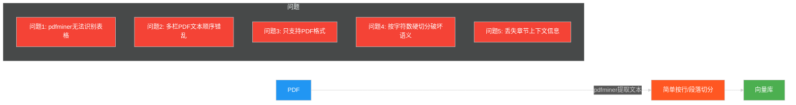
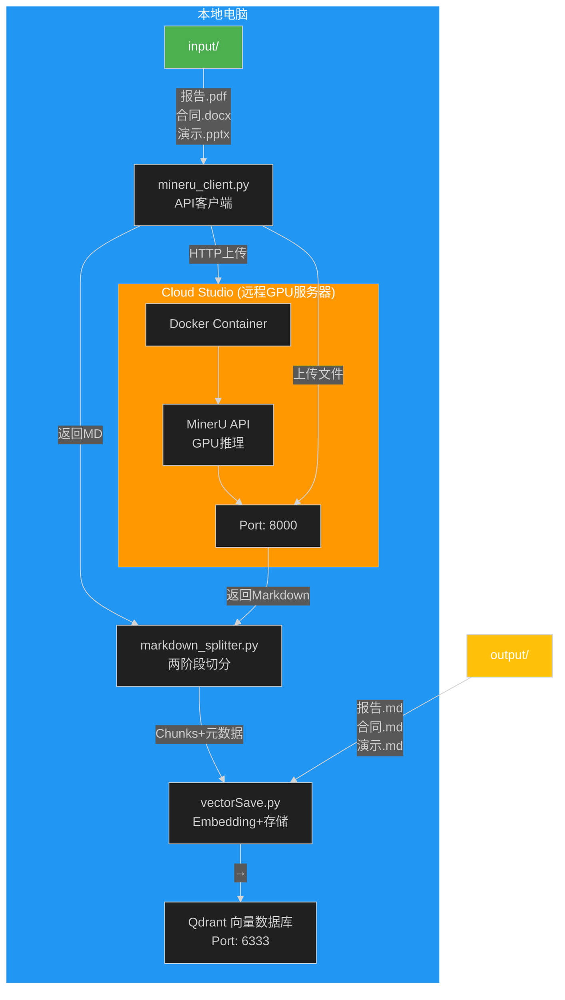
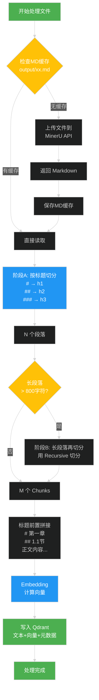
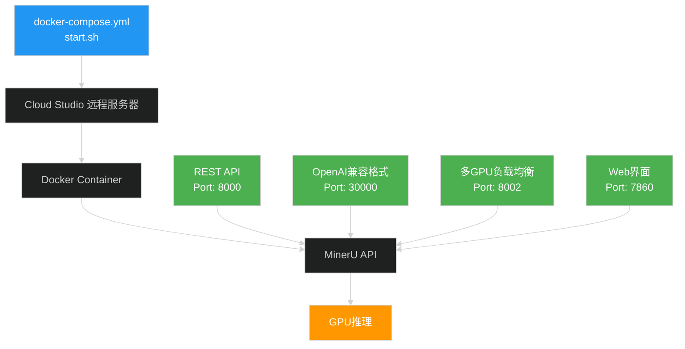
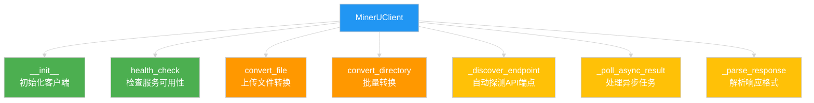
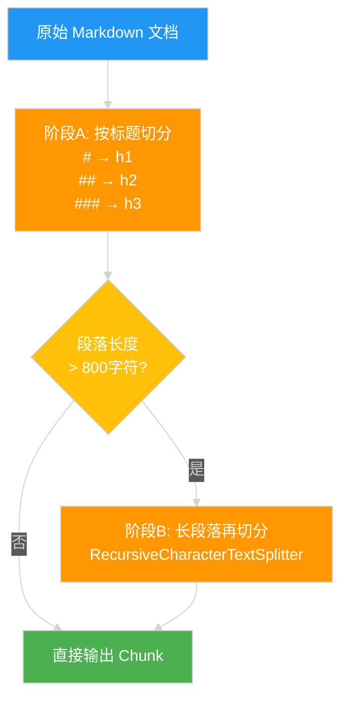
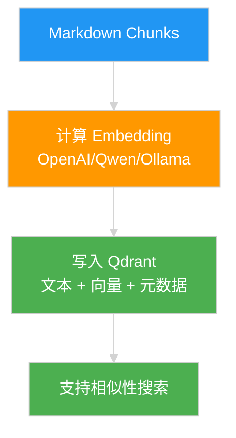
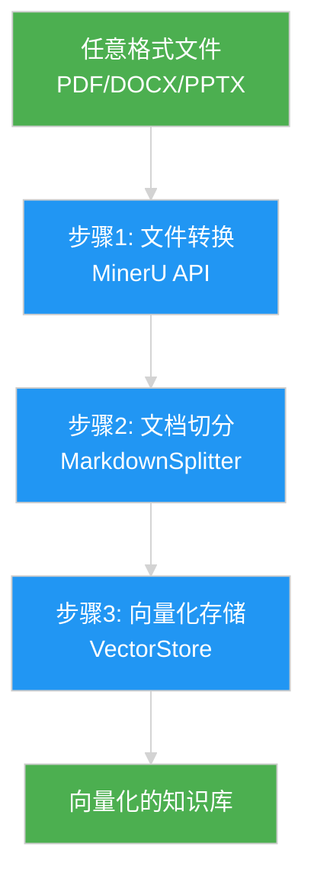

# MinerU Cloud Studio 部署 + 本地知识库对接 完整指南

> 本文档整合了 MinerU GPU 解析服务在 Cloud Studio 环境的部署方案及本地知识库对接的完整实现，涵盖部署概述、环境准备、详细部署步骤、本地知识库对接流程、常见问题解决等内容。

---

## 目录

- [一、方案总览](#一方案总览)
- [二、环境准备](#二环境准备)
- [三、Cloud Studio 端部署](#三cloud-studio-端部署)
- [四、本地端对接代码](#四本地端对接代码)
- [五、模块功能详解](#五模块功能详解)
- [六、数据流转全链路解析](#六数据流转全链路解析)
- [七、使用指南](#七使用指南)
- [八、常见问题与排错](#八常见问题与排错)
- [九、与旧方案对比](#九与旧方案对比)
- [十、注意事项与最佳实践](#十注意事项与最佳实践)

---

## 一、方案总览

### 1.1 解决什么问题

#### ❌ 旧方案的痛点



| 问题 | 描述 |
|------|------|
| 表格识别失败 | pdfminer 无法识别表格，表格数据变成乱码 |
| 多栏布局错乱 | 多栏 PDF 文本顺序错乱，学术论文常见 |
| 格式支持有限 | 只支持 PDF，不支持 DOCX/PPTX/HTML |
| 语义被破坏 | 按字符数硬切分，破坏语义完整性 |
| 上下文丢失 | 切分后丢失"这段话属于哪个章节"的上下文信息 |

#### ✅ 新方案的解决

```mermaid
%%{init: {'theme': 'dark'}}%%
flowchart LR
    A[任意格式文件] -->|MinerU GPU高保真解析| B[输出标准Markdown<br/>保留#标题、表格结构]
    B -->|按Markdown标题树语义切分| C[每个Chunk自带元数据<br/>{h1:"第一章", h2:"1.1节"}]
    C -->|标题信息前置拼接| D[大幅提升检索精度]
    
    style A fill:#4CAF50,color:#ffffff
    style B fill:#2196F3,color:#ffffff
    style C fill:#FFC107,color:#ffffff
    style D fill:#4CAF50,color:#ffffff
```

### 1.2 核心技术路线

**"Markdown 统一化" + "两阶段语义切分"** — 构建高质量知识库的黄金法则：

| 步骤 | 说明 |
|------|------|
| **第一步：Markdown 统一化** | 不管什么格式，全部高保真转换为 Markdown。使用 MinerU（GPU 加速的文档解析引擎），部署在 Cloud Studio 的 GPU 服务器上，本地通过 HTTP API 调用 |
| **第二步：两阶段语义切分** | 阶段A：按 `#` `##` `###` 标题层级切分（保证同一章节内容在一起）；阶段B：超长章节再用 `RecursiveCharacterTextSplitter` 软切分 |

### 1.3 整体架构图



### 1.4 工作流程图



---

## 二、环境准备

### 2.1 Cloud Studio 端环境要求

| 组件 | 要求 | 说明 |
|------|------|------|
| GPU | ≥16GB 显存 | 推荐 RTX 3090/4090 或 A10/A100 |
| Docker | ≥20.10 | 容器运行环境 |
| NVIDIA Container Toolkit | 最新版 | GPU 容器支持 |
| 操作系统 | Linux (Ubuntu/CentOS) | 推荐 Ubuntu 20.04+ |
| 磁盘空间 | ≥30GB | 模型文件约 10GB |

### 2.2 本地端环境要求

| 组件 | 版本 | 说明 |
|------|------|------|
| Python | 3.10+ | 推荐 3.10 或 3.11 |
| Qdrant | 本地或远程 | 向量数据库 |
| 网络环境 | 可访问 Cloud Studio | HTTP API 通信 |

### 2.3 依赖清单

```txt
# requirements.txt
requests>=2.31.0
httpx>=0.25.0
langchain>=0.3.0
langchain-text-splitters>=0.3.0
qdrant-client>=1.9.0
openai>=1.30.0
tiktoken>=0.7.0
python-dotenv>=1.0.0
tqdm>=4.66.0
```

---

## 三、Cloud Studio 端部署

### 3.1 项目文件结构

```
cloud-mineru/
├── docker-compose.yml      # Docker 编排配置
├── .env                    # 环境变量（可选）
└── start.sh                # 一键启动脚本
```

### 3.2 docker-compose.yml

```yaml
# cloud-mineru/docker-compose.yml
version: "3.8"

services:
  mineru-api:
    image: mineru:latest
    container_name: mineru-api
    restart: always
    ports:
      - "8000:8000"
    environment:
      MINERU_MODEL_SOURCE: local
    entrypoint: mineru-api
    command:
      --host 0.0.0.0
      --port 8000
      # 显存不足时取消注释并降低值
      # --gpu-memory-utilization 0.5
    ulimits:
      memlock: -1
      stack: 67108864
    ipc: host
    healthcheck:
      test: ["CMD-SHELL", "curl -f http://localhost:8000/health || exit 1"]
      interval: 30s
      timeout: 10s
      retries: 5
      start_period: 120s
    deploy:
      resources:
        reservations:
          devices:
            - driver: nvidia
              device_ids: ["0"]
              capabilities: [gpu]

  # 可选：OpenAI 兼容格式 API
  mineru-openai-server:
    image: mineru:latest
    container_name: mineru-openai
    restart: always
    ports:
      - "30000:30000"
    entrypoint: mineru-openai-server
    command:
      --host 0.0.0.0
      --port 30000
    profiles:
      - openai

  # 可选：Web 界面
  mineru-gradio:
    image: mineru:latest
    container_name: mineru-gradio
    restart: always
    ports:
      - "7860:7860"
    entrypoint: mineru-gradio
    profiles:
      - gradio
```

**GPU 显存调优参数**：

| 显存大小 | 推荐配置 | 说明 |
|----------|----------|------|
| 24GB | `--gpu-memory-utilization 0.7` | 默认值 |
| 16GB | `--gpu-memory-utilization 0.5` | 适中 |
| 12GB | `--gpu-memory-utilization 0.4` | 较低 |
| OOM 错误 | 继续降低值 | 持续调整 |

### 3.3 一键启动脚本

```bash
#!/bin/bash
# cloud-mineru/start.sh
#!/bin/bash
# cloud-mineru/start.sh
# MinerU GPU 服务一键部署脚本

set -e

# 切换到脚本所在目录，确保相对路径正确
cd "$(dirname "$0")"

# ====== 颜色定义 ======
RED='\033[0;31m'
GREEN='\033[0;32m'
YELLOW='\033[1;33m'
BLUE='\033[0;34m'
NC='\033[0m' # No Color

log_info()  { echo -e "${BLUE}[INFO]${NC} $1"; }
log_ok()    { echo -e "${GREEN}[OK]${NC} $1"; }
log_warn()  { echo -e "${YELLOW}[WARN]${NC} $1"; }
log_error() { echo -e "${RED}[ERROR]${NC} $1"; }

echo ""
echo "=========================================="
echo "  🚀 MinerU Docker GPU 部署脚本"
echo "=========================================="
echo ""

# ============================================
# Step 1: 检查 Docker
# ============================================
log_info "[1/6] 检查 Docker 环境..."

if ! command -v docker &> /dev/null; then
    log_error "Docker 未安装！"
    echo "  请执行: curl -fsSL https://get.docker.com | sudo sh"
    exit 1
fi

DOCKER_VERSION=$(docker --version | grep -oP '\d+\.\d+' | head -1)
log_ok "Docker 版本: $DOCKER_VERSION"

if ! docker compose version &> /dev/null; then
    log_error "Docker Compose V2 未安装！"
    echo "  请升级 Docker 或安装 docker-compose-plugin"
    exit 1
fi
log_ok "Docker Compose 已就绪"

# ============================================
# Step 2: 检查 GPU
# ============================================
log_info "[2/6] 检查 GPU 环境..."

if ! command -v nvidia-smi &> /dev/null; then
    log_error "nvidia-smi 未找到，请确认 NVIDIA 驱动已安装"
    exit 1
fi

GPU_NAME=$(nvidia-smi --query-gpu=name --format=csv,noheader | head -1)
GPU_MEM=$(nvidia-smi --query-gpu=memory.total --format=csv,noheader | head -1)
DRIVER_VER=$(nvidia-smi --query-gpu=driver_version --format=csv,noheader | head -1)

log_ok "GPU: $GPU_NAME"
log_ok "显存: $GPU_MEM"
log_ok "驱动版本: $DRIVER_VER"

# 检查驱动版本
DRIVER_MAJOR=$(echo $DRIVER_VER | cut -d. -f1)
if [ "$DRIVER_MAJOR" -lt 525 ]; then
    log_error "NVIDIA 驱动版本 $DRIVER_VER 过低，需要 >= 525"
    exit 1
fi

# ============================================
# Step 3: 检查 nvidia-container-toolkit
# ============================================
log_info "[3/6] 检查 nvidia-container-toolkit..."

if ! docker info 2>/dev/null | grep -q "nvidia"; then
    log_warn "nvidia-container-toolkit 未配置，开始安装..."
    
    distribution=$(. /etc/os-release; echo $ID$VERSION_ID)
    
    curl -fsSL https://nvidia.github.io/libnvidia-container/gpgkey \
      | sudo gpg --dearmor -o /usr/share/keyrings/nvidia-container-toolkit-keyring.gpg 2>/dev/null
    
    curl -s -L https://nvidia.github.io/libnvidia-container/$distribution/libnvidia-container.list \
      | sed 's#deb https://#deb [signed-by=/usr/share/keyrings/nvidia-container-toolkit-keyring.gpg] https://#g' \
      | sudo tee /etc/apt/sources.list.d/nvidia-container-toolkit.list > /dev/null
    
    sudo apt-get update -qq
    sudo apt-get install -y -qq nvidia-container-toolkit
    sudo nvidia-ctk runtime configure --runtime=docker
    sudo systemctl restart docker
    
    log_ok "nvidia-container-toolkit 安装完成"
else
    log_ok "nvidia-container-toolkit 已就绪"
fi

# 验证容器内 GPU 访问
log_info "  验证容器 GPU 访问..."
if docker run --rm --gpus all nvidia/cuda:12.2.0-base-ubuntu22.04 nvidia-smi > /dev/null 2>&1; then
    log_ok "容器 GPU 访问正常"
else
    log_error "容器内无法访问 GPU，请检查 nvidia-container-toolkit 配置"
    exit 1
fi

# ============================================
# Step 4: 准备 MinerU 镜像
# ============================================
log_info "[4/6] 准备 MinerU Docker 镜像..."

if docker images --format "{{.Repository}}:{{.Tag}}" | grep -q "mineru:latest"; then
    log_ok "MinerU 镜像已存在"
    REBUILD=""
    read -t 10 -p "  是否重新构建镜像? (y/N, 10秒后自动跳过): " REBUILD || true
    echo ""
fi

if ! docker images --format "{{.Repository}}:{{.Tag}}" | grep -q "mineru:latest" || [ "$REBUILD" = "y" ]; then
    log_info "开始构建 MinerU 镜像（预计 10-30 分钟）..."
    
    if [ ! -d "MinerU" ]; then
        log_info "  克隆 MinerU 源码..."
        git clone --depth 1 https://github.com/opendatalab/MinerU.git
    fi
    
    log_info "  构建 Docker 镜像..."
    docker build \
      -t mineru:latest \
      -f MinerU/docker/global/Dockerfile \
      --build-arg BUILDKIT_INLINE_CACHE=1 \
      . 2>&1 | tail -20
    log_ok "MinerU 镜像构建完成"
else
    log_ok "跳过镜像构建"
fi

# ============================================
# Step 5: 创建数据目录并启动服务
# ============================================
log_info "[5/6] 启动 MinerU API 服务..."

# 创建必要目录
mkdir -p data/input data/output logs

# 停止旧容器（如果存在）
if docker ps -a --format "{{.Names}}" | grep -q "mineru-api"; then
    log_info "  停止旧容器..."
    docker compose down 2>/dev/null || true
fi

# 启动服务
docker compose up -d mineru-api

log_ok "容器已启动"
echo ""

# 启动实时日志跟踪（后台）
log_info "实时日志:"
echo "  ------------------------------------------------------------"

# 后台启动日志跟踪，脚本退出时自动清理
docker logs -f mineru-api 2>&1 &
LOG_PID=$!
trap "kill $LOG_PID 2>/dev/null; wait $LOG_PID 2>/dev/null" EXIT

echo ""

# ============================================
# Step 6: 等待服务就绪
# ============================================
log_info "[6/6] 等待服务就绪..."
echo "  首次启动需加载模型，预计 2-5 分钟..."
echo ""

MAX_WAIT=300  # 最大等待 5 分钟
INTERVAL=5
ELAPSED=0

while [ $ELAPSED -lt $MAX_WAIT ]; do
    # 检查容器是否在运行
    if ! docker ps --format "{{.Names}}" | grep -q "mineru-api"; then
        log_error "容器已退出！查看日志:"
        echo ""
        docker logs --tail 50 mineru-api
        exit 1
    fi
    
    # 检查健康状态
    if curl -sf http://localhost:8000/health > /dev/null 2>&1; then
        echo ""
        echo ""
        echo -e "${GREEN}==========================================${NC}"
        echo -e "${GREEN}  ✅ MinerU API 服务部署成功！${NC}"
        echo -e "${GREEN}==========================================${NC}"
        echo ""
        echo "  📍 API 地址:    http://localhost:8000"
        echo "  💚 健康检查:    http://localhost:8000/health"
        echo "  📖 API 文档:    http://localhost:8000/docs"
        echo "  🖥️  GPU:        $GPU_NAME ($GPU_MEM)"
        echo ""
        echo "  常用命令:"
        echo "    查看日志:     docker logs -f mineru-api"
        echo "    停止服务:     docker compose down"
        echo "    重启服务:     docker compose restart"
        echo ""
        echo "  (实时日志运行中，按 Ctrl-C 停止日志跟踪)"
        echo ""

        # 保持日志前台运行
        wait $LOG_PID 2>/dev/null
        exit 0
    fi
    
    sleep $INTERVAL
    ELAPSED=$((ELAPSED + INTERVAL))
done

echo ""
echo ""
log_error "服务启动超时（${MAX_WAIT}s）"
echo "  (日志仍在后台运行，可 Ctrl+C 退出)"
echo ""
echo "  排查步骤:"
echo "  1. 查看容器日志: docker logs --tail 100 mineru-api"
echo "  2. 查看容器状态: docker ps -a"
echo "  3. 进入容器调试: docker exec -it mineru-api bash"
echo ""

# 保持日志前台运行，用户 Ctrl+C 退出
wait $LOG_PID 2>/dev/null
exit 1

```

---

## 四、本地端对接代码

### 4.1 项目文件结构

```
local-rag-project/
├── utils/
│   └── config.py              # 统一配置
├── mineru_client.py           # MinerU API 客户端
├── markdown_splitter.py       # Markdown 两阶段切分
├── vectorSave2.py             # 向量存储（增强版）
├── pipeline.py                # 端到端处理流水线
├── requirements.txt           # 依赖
├── .env.example               # 环境变量模板
├── input/                     # 输入文件目录
│   ├── 健康档案.pdf
│   ├── report.docx
│   └── slides.pptx
├── output/                    # Markdown 缓存输出
│   └── (自动生成)
└── qdrantDB/                  # Qdrant 本地持久化
```

### 4.2 配置文件 (utils/config.py)

```python
# utils/config.py
"""
统一配置文件 - MinerU + 知识库构建
"""
import os
import logging
from dotenv import load_dotenv

load_dotenv()


class Config:
    """统一的配置类，集中管理所有常量"""

    # ============================================================
    # MinerU 远程服务配置
    # ============================================================
    MINERU_API_URL = os.getenv("MINERU_API_URL", "http://localhost:8000")
    MINERU_TIMEOUT = int(os.getenv("MINERU_TIMEOUT", "300"))
    MINERU_PARSE_METHOD = os.getenv("MINERU_PARSE_METHOD", "auto")

    # ============================================================
    # Markdown 切分配置
    # ============================================================
    MARKDOWN_HEADERS = [
        ("#", "h1"),
        ("##", "h2"),
        ("###", "h3"),
        ("####", "h4"),
    ]
    CHUNK_SIZE = 800
    CHUNK_OVERLAP = 200
    SEPARATORS = ["\n\n", "\n", "。", "；", ".", ";", " ", ""]
    MAX_CHUNK_LENGTH = 1500

    # ============================================================
    # Embedding 模型配置
    # ============================================================
    LLM_TYPE = os.getenv("LLM_TYPE", "qwen")
    
    # OpenAI
    OPENAI_API_BASE = os.getenv("OPENAI_BASE_URL", "https://api.openai.com/v1")
    OPENAI_API_KEY = os.getenv("OPENAI_API_KEY", "")
    OPENAI_EMBEDDING_MODEL = "text-embedding-3-small"
    
    # Qwen
    QWEN_API_BASE = "https://dashscope.aliyuncs.com/compatible-mode/v1"
    QWEN_API_KEY = os.getenv("DASHSCOPE_API_KEY", "")
    QWEN_EMBEDDING_MODEL = "text-embedding-v3"
    
    # Ollama
    OLLAMA_API_BASE = "http://localhost:11434/v1"
    OLLAMA_API_KEY = "ollama"
    OLLAMA_EMBEDDING_MODEL = "bge-m3:latest"
    
    # OneAPI
    ONEAPI_API_BASE = os.getenv("ONEAPI_API_BASE", "http://localhost:3000/v1")
    ONEAPI_API_KEY = os.getenv("ONEAPI_API_KEY", "")
    ONEAPI_EMBEDDING_MODEL = "text-embedding-v1"

    EMBEDDING_BATCH_SIZE = 25

    # ============================================================
    # Qdrant 向量数据库配置
    # ============================================================
    QDRANT_URL = os.getenv("QDRANT_URL", "http://127.0.0.1:6333")
    QDRANT_API_KEY = os.getenv("QDRANT_API_KEY", None)
    QDRANT_COLLECTION_NAME = os.getenv("QDRANT_COLLECTION_NAME", "knowledge_base")
    QDRANT_LOCAL_PATH = os.getenv("QDRANT_LOCAL_PATH", "qdrantDB")

    # ============================================================
    # 文件路径配置
    # ============================================================
    INPUT_DIR = "input"
    OUTPUT_DIR = "output"
    SUPPORTED_EXTENSIONS = {".pdf", ".docx", ".pptx", ".html", ".htm", ".xlsx", ".doc", ".ppt"}

    # ============================================================
    # 日志配置
    # ============================================================
    LOG_FILE = "output/app.log"
    LOG_LEVEL = logging.INFO
    MAX_BYTES = 5 * 1024 * 1024
    BACKUP_COUNT = 3

    @classmethod
    def get_api_base(cls) -> str:
        """根据 LLM_TYPE 返回对应的 API Base URL"""
        api_bases = {
            "openai": cls.OPENAI_API_BASE,
            "qwen": cls.QWEN_API_BASE,
            "ollama": cls.OLLAMA_API_BASE,
            "oneapi": cls.ONEAPI_API_BASE,
        }
        return api_bases.get(cls.LLM_TYPE, cls.OPENAI_API_BASE)

    @classmethod
    def get_api_key(cls) -> str:
        """根据 LLM_TYPE 返回对应的 API Key"""
        api_keys = {
            "openai": cls.OPENAI_API_KEY,
            "qwen": cls.QWEN_API_KEY,
            "ollama": cls.OLLAMA_API_KEY,
            "oneapi": cls.ONEAPI_API_KEY,
        }
        return api_keys.get(cls.LLM_TYPE, "")

    @classmethod
    def get_embedding_model(cls) -> str:
        """根据 LLM_TYPE 返回对应的 Embedding 模型名称"""
        models = {
            "openai": cls.OPENAI_EMBEDDING_MODEL,
            "qwen": cls.QWEN_EMBEDDING_MODEL,
            "ollama": cls.OLLAMA_EMBEDDING_MODEL,
            "oneapi": cls.ONEAPI_EMBEDDING_MODEL,
        }
        return models.get(cls.LLM_TYPE, cls.OPENAI_EMBEDDING_MODEL)
```

### 4.3 环境变量模板 (.env.example)

```bash
# .env.example
# 复制此文件为 .env 并填入实际值

# ============================================================
# MinerU 远程服务配置
# ============================================================
MINERU_API_URL=https://your-mineru-url.preview.myide.io
MINERU_TIMEOUT=300
MINERU_PARSE_METHOD=auto

# ============================================================
# Embedding 模型配置
# ============================================================
LLM_TYPE=qwen

# OpenAI 配置
OPENAI_BASE_URL=https://api.openai.com/v1
OPENAI_API_KEY=sk-your-openai-key

# Qwen 配置
DASHSCOPE_API_KEY=sk-your-dashscope-key

# OneAPI 配置
ONEAPI_API_BASE=http://your-oneapi-host:3000/v1
ONEAPI_API_KEY=sk-your-oneapi-key

# ============================================================
# Qdrant 向量数据库配置
# ============================================================
QDRANT_URL=http://127.0.0.1:6333
QDRANT_API_KEY=
QDRANT_COLLECTION_NAME=knowledge_base
QDRANT_LOCAL_PATH=qdrantDB
```

### 4.4 MinerU 客户端 (mineru_client.py)

```python
# mineru_client.py
"""
MinerU 远程 API 客户端
支持多种 API 端点自动探测，兼容 MinerU 不同版本
"""
import os
import time
import json
import logging
import requests
from pathlib import Path
from typing import Optional, Dict, Any, List

from utils.config import Config

logger = logging.getLogger(__name__)

os.environ['NO_PROXY'] = 'localhost,127.0.0.1'

MIME_TYPE_MAP = {
    ".pdf": "application/pdf",
    ".docx": "application/vnd.openxmlformats-officedocument.wordprocessingml.document",
    ".pptx": "application/vnd.openxmlformats-officedocument.presentationml.presentation",
    ".xlsx": "application/vnd.openxmlformats-officedocument.spreadsheetml.sheet",
    ".html": "text/html",
    ".htm": "text/html",
    ".doc": "application/msword",
    ".ppt": "application/vnd.ms-powerpoint",
}


class MinerUClient:
    """
    MinerU 远程 API 客户端。
    
    支持自动探测 API 端点，兼容不同版本的 MinerU 服务。
    """

    CONVERT_ENDPOINTS = [
        "/file/convert",
        "/v1/file/convert",
        "/convert",
        "/v1/convert",
        "/file_parse",
        "/v1/parse",
        "/api/v1/extract",
    ]

    def __init__(self, api_url: str = None, timeout: int = None):
        """
        初始化 MinerU 客户端。

        Args:
            api_url: MinerU 服务地址，如 "https://xxx-8000.preview.myide.io"
            timeout: 请求超时秒数，默认 300 秒
        """
        self.api_url = (api_url or Config.MINERU_API_URL).rstrip("/")
        self.timeout = timeout or Config.MINERU_TIMEOUT
        self._convert_endpoint = None
        self._session = requests.Session()
        logger.info(f"MinerU Client 初始化: {self.api_url}")

    def health_check(self) -> bool:
        """
        检查 MinerU 服务是否可用。

        Returns:
            bool: True=可用, False=不可用
        """
        try:
            resp = self._session.get(f"{self.api_url}/health", timeout=10)
            if resp.status_code == 200:
                logger.info(f"✅ MinerU 服务健康: {resp.json()}")
                return True
        except Exception as e:
            logger.error(f"❌ MinerU 服务不可达: {e}")
        return False

    def _discover_endpoint(self) -> str:
        """自动探测可用的文件转换 API 端点"""
        if self._convert_endpoint:
            return self._convert_endpoint

        # 优先从 OpenAPI schema 获取
        try:
            resp = self._session.get(f"{self.api_url}/openapi.json", timeout=10)
            if resp.status_code == 200:
                schema = resp.json()
                paths = schema.get("paths", {})
                for endpoint in self.CONVERT_ENDPOINTS:
                    if endpoint in paths:
                        self._convert_endpoint = endpoint
                        logger.info(f"从 OpenAPI schema 发现端点: {endpoint}")
                        return endpoint
                for path, methods in paths.items():
                    if "post" in methods and any(kw in path.lower() for kw in ["convert", "parse", "extract"]):
                        self._convert_endpoint = path
                        logger.info(f"从 OpenAPI schema 发现端点: {path}")
                        return path
        except Exception as e:
            logger.debug(f"无法获取 OpenAPI schema: {e}")

        # 回退: 逐个探测端点
        test_file_content = b"%PDF-1.4 test"
        for endpoint in self.CONVERT_ENDPOINTS:
            try:
                resp = self._session.post(
                    f"{self.api_url}{endpoint}",
                    files={"file": ("test.pdf", test_file_content, "application/pdf")},
                    timeout=15
                )
                if resp.status_code not in (404, 405):
                    self._convert_endpoint = endpoint
                    logger.info(f"探测到可用端点: {endpoint}")
                    return endpoint
            except Exception:
                continue

        self._convert_endpoint = "/file/convert"
        logger.warning(f"未探测到端点，使用默认: {self._convert_endpoint}")
        return self._convert_endpoint

    def convert_file(
        self,
        file_path: str,
        parse_method: str = None,
        return_images: bool = False,
        **kwargs
    ) -> Dict[str, Any]:
        """
        上传文件到 MinerU 进行转换，返回 Markdown 结果。

        Args:
            file_path: 本地文件路径
            parse_method: 解析方法 (auto/ocr/txt)
            return_images: 是否返回图片
            **kwargs: 其他 MinerU 支持的参数

        Returns:
            dict: {"success": bool, "markdown": str, "images": dict, "metadata": dict}
        """
        file_path = Path(file_path)
        if not file_path.exists():
            raise FileNotFoundError(f"文件不存在: {file_path}")

        endpoint = self._discover_endpoint()
        url = f"{self.api_url}{endpoint}"
        parse_method = parse_method or Config.MINERU_PARSE_METHOD
        mime_type = self._get_mime_type(file_path)

        logger.info(f"📤 上传文件: {file_path.name} ({file_path.stat().st_size / 1024:.1f} KB)")

        with open(file_path, "rb") as f:
            files = {"file": (file_path.name, f, mime_type)}
            data = {"parse_method": parse_method}
            data.update(kwargs)

            try:
                resp = self._session.post(url, files=files, data=data, timeout=self.timeout)
                resp.raise_for_status()
                result = resp.json()
            except requests.exceptions.Timeout:
                logger.error(f"⏱️ 请求超时 ({self.timeout}s)")
                return {"success": False, "error": "timeout", "markdown": ""}
            except requests.exceptions.HTTPError as e:
                if resp.status_code == 202:
                    return self._poll_async_result(resp.json())
                return {"success": False, "error": str(e), "markdown": ""}
            except Exception as e:
                logger.error(f"❌ 请求失败: {e}")
                return {"success": False, "error": str(e), "markdown": ""}

        return self._parse_response(result, file_path.name)

    def _poll_async_result(self, initial_response: dict, poll_interval: int = 3, max_wait: int = None) -> Dict[str, Any]:
        """轮询异步任务结果"""
        task_id = initial_response.get("task_id") or initial_response.get("id")
        if not task_id:
            return {"success": False, "error": "no task_id", "markdown": ""}

        max_wait = max_wait or self.timeout
        result_endpoints = [f"/task/{task_id}", f"/result/{task_id}", f"/file/convert/{task_id}"]
        start_time = time.time()

        while time.time() - start_time < max_wait:
            for ep in result_endpoints:
                try:
                    resp = self._session.get(f"{self.api_url}{ep}", timeout=10)
                    if resp.status_code == 200:
                        result = resp.json()
                        status = result.get("status", "").lower()
                        if status in ("completed", "done", "success", "finished"):
                            return self._parse_response(result, task_id)
                        elif status in ("failed", "error"):
                            return {"success": False, "error": result, "markdown": ""}
                        break
                except Exception:
                    continue
            time.sleep(poll_interval)

        return {"success": False, "error": "timeout", "markdown": ""}

    def _parse_response(self, result: dict, filename: str) -> Dict[str, Any]:
        """解析 MinerU 响应，兼容不同版本格式"""
        markdown = result.get("markdown") or result.get("data") or result.get("result") or result.get("text") or ""
        
        images = result.get("images", {})
        if not images and "data" in result and isinstance(result["data"], dict):
            images = result["data"].get("images", {})

        metadata = result.get("metadata", {})
        if not metadata and "data" in result and isinstance(result["data"], dict):
            metadata = result["data"].get("metadata", {})

        return {"success": True, "markdown": markdown, "images": images, "metadata": metadata, "filename": filename}

    def _get_mime_type(self, file_path: Path) -> str:
        """获取文件的 MIME 类型"""
        return MIME_TYPE_MAP.get(file_path.suffix.lower(), "application/octet-stream")

    def convert_directory(
        self,
        input_dir: str,
        output_dir: str,
        skip_existing: bool = True,
        **kwargs
    ) -> Dict[str, str]:
        """
        批量转换目录下所有支持的文件。

        Args:
            input_dir: 输入目录
            output_dir: 输出目录
            skip_existing: 是否跳过已存在的缓存文件
            **kwargs: 传递给 convert_file 的参数

        Returns:
            dict: {文件名: Markdown内容}
        """
        input_path = Path(input_dir)
        output_path = Path(output_dir)
        output_path.mkdir(parents=True, exist_ok=True)

        results = {}
        for ext in Config.SUPPORTED_EXTENSIONS:
            for file_path in input_path.glob(f"*{ext}"):
                md_path = output_path / f"{file_path.stem}.md"
                
                if skip_existing and md_path.exists():
                    logger.info(f"⏭️ 跳过已缓存: {file_path.name}")
                    results[file_path.name] = md_path.read_text(encoding="utf-8")
                    continue

                result = self.convert_file(str(file_path), **kwargs)
                if result.get("success"):
                    md_content = result["markdown"]
                    md_path.write_text(md_content, encoding="utf-8")
                    results[file_path.name] = md_content
                    logger.info(f"✅ 转换完成: {file_path.name}")
                else:
                    logger.error(f"❌ 转换失败: {file_path.name} - {result.get('error')}")

        return results
```

### 4.5 Markdown 切分器 (markdown_splitter.py)

```python
# markdown_splitter.py
"""
Markdown 两阶段语义切分器
阶段A: 按标题层级切分
阶段B: 长段落用 RecursiveCharacterTextSplitter 再切分
"""
import re
import logging
from typing import List, Dict, Any, Optional

try:
    from langchain_text_splitters import RecursiveCharacterTextSplitter
    _HAS_LANGCHAIN_SPLITTER = True
except ImportError:
    _HAS_LANGCHAIN_SPLITTER = False

from utils.config import Config

logger = logging.getLogger(__name__)


class MarkdownSplitter:
    """Markdown 两阶段语义切分器"""

    def __init__(
        self,
        headers: List[tuple] = None,
        chunk_size: int = None,
        chunk_overlap: int = None,
        separators: List[str] = None,
        max_chunk_length: int = None
    ):
        """
        初始化 Markdown 切分器。

        Args:
            headers: 标题层级配置列表，如 [("#", "h1"), ("##", "h2")]
            chunk_size: 阶段B最大字符数
            chunk_overlap: 阶段B重叠字符数
            separators: 阶段B分隔符列表
            max_chunk_length: 单个Chunk最大长度上限
        """
        self.headers = headers or Config.MARKDOWN_HEADERS
        self.chunk_size = chunk_size or Config.CHUNK_SIZE
        self.chunk_overlap = chunk_overlap or Config.CHUNK_OVERLAP
        self.separators = separators or Config.SEPARATORS
        self.max_chunk_length = max_chunk_length or Config.MAX_CHUNK_LENGTH

    def split_text(self, text: str, metadata: Dict[str, Any] = None) -> List[Dict[str, Any]]:
        """
        对 Markdown 文本进行两阶段切分。

        Args:
            text: Markdown 文本
            metadata: 基础元数据

        Returns:
            List[Dict]: 切分后的块列表，每个块包含 content 和 metadata
        """
        if not text or not text.strip():
            return []

        metadata = metadata or {}
        
        # 阶段A: 按标题切分
        chunks = self._split_by_headers(text, metadata)
        
        # 阶段B: 长段落再切分
        final_chunks = []
        for chunk in chunks:
            if len(chunk["content"]) > self.chunk_size:
                sub_chunks = self._recursive_split(chunk["content"], chunk["metadata"])
                final_chunks.extend(sub_chunks)
            else:
                final_chunks.append(chunk)

        logger.info(f"切分完成: {len(final_chunks)} 个 chunks")
        return final_chunks

    def _split_by_headers(self, text: str, base_metadata: Dict[str, Any]) -> List[Dict[str, Any]]:
        """阶段A: 按标题层级切分"""
        lines = text.split("\n")
        chunks = []
        current_chunk = []
        current_headers = {level: "" for _, level in self.headers}
        
        header_pattern = re.compile(r"^(#{1,6})\s+(.+)$")

        for line in lines:
            match = header_pattern.match(line)
            if match:
                # 保存当前 chunk
                if current_chunk:
                    content = "\n".join(current_chunk).strip()
                    if content:
                        chunks.append({
                            "content": self._build_context_string(current_headers) + content,
                            "metadata": {**base_metadata, **current_headers}
                        })
                    current_chunk = []
                
                # 更新标题
                header_prefix = match.group(1)
                header_text = match.group(2).strip()
                for prefix, level in self.headers:
                    if header_prefix == prefix:
                        current_headers[level] = header_text
                        # 清除下级标题
                        for p2, l2 in self.headers:
                            if len(p2) > len(prefix):
                                current_headers[l2] = ""
                        break
            
            current_chunk.append(line)

        # 保存最后一个 chunk
        if current_chunk:
            content = "\n".join(current_chunk).strip()
            if content:
                chunks.append({
                    "content": self._build_context_string(current_headers) + content,
                    "metadata": {**base_metadata, **current_headers}
                })

        return chunks

    def _recursive_split(self, text: str, metadata: Dict[str, Any]) -> List[Dict[str, Any]]:
        """阶段B: 对长文本进行递归切分"""
        if _HAS_LANGCHAIN_SPLITTER:
            splitter = RecursiveCharacterTextSplitter(
                chunk_size=self.chunk_size,
                chunk_overlap=self.chunk_overlap,
                separators=self.separators
            )
            sub_texts = splitter.split_text(text)
        else:
            sub_texts = self._fallback_split(text)

        return [{"content": t, "metadata": metadata} for t in sub_texts]

    def _fallback_split(self, text: str) -> List[str]:
        """无 langchain 时的简单切分"""
        chunks = []
        for sep in self.separators:
            if sep in text:
                parts = text.split(sep)
                current = ""
                for part in parts:
                    if len(current) + len(part) + len(sep) <= self.chunk_size:
                        current += sep + part if current else part
                    else:
                        if current:
                            chunks.append(current)
                        current = part
                if current:
                    chunks.append(current)
                return chunks if chunks else [text]
        return [text]

    def _build_context_string(self, headers: Dict[str, str]) -> str:
        """构建标题上下文字符串"""
        context_parts = []
        for prefix, level in self.headers:
            if headers.get(level):
                context_parts.append(f"{prefix} {headers[level]}")
        return "\n".join(context_parts) + "\n\n" if context_parts else ""
```

---

## 五、模块功能详解

### 5.1 MinerU Docker 服务



**MinerU 是什么？**

| 特性 | 说明 |
|------|------|
| 开发者 | OpenDataLab 开源 |
| 支持格式 | PDF / DOCX / PPTX / HTML / XLSX |
| 核心能力 | 深度学习版面分析，自动识别标题、正文、表格、图片、公式 |
| 布局处理 | 正确处理多栏布局（学术论文常见） |
| 表格输出 | 转为标准 Markdown 表格语法 |
| 硬件要求 | GPU 加速（推荐 ≥16GB 显存） |
| 输出格式 | 标准 Markdown |

**服务选择建议**：

| 场景 | 推荐服务 | 端口 | 说明 |
|------|----------|------|------|
| 程序化调用 | mineru-api | 8000 | REST API，直接上传文件返回 Markdown |
| OpenAI SDK 调用 | mineru-openai-server | 30000 | Chat Completion 格式，base64 上传 |
| 多 GPU 并行 | mineru-router | 8002 | 自动分发任务到多个 GPU |
| 手动测试/演示 | mineru-gradio | 7860 | 浏览器拖拽上传，可视化查看结果 |

### 5.2 MinerU Client



**自动端点探测机制**：

MinerU 不同版本的 API 端点路径可能不同：
- v0.x: `POST /file_parse`
- v1.x: `POST /file/convert`
- v2.x: `POST /v1/file/convert`

客户端自动适配流程：
1. 首先尝试访问 `GET /openapi.json` 获取 Swagger 文档
2. 从文档中查找包含 `"convert"`/`"parse"` 的 POST 端点
3. 如果获取不到文档，逐个尝试预定义的端点列表
4. 找到可用端点后缓存，后续请求直接使用

**parse_method 参数说明**：

| 参数值 | 说明 | 适用场景 |
|--------|------|----------|
| `"auto"` | MinerU 自动判断使用 OCR 还是文本提取 | 大部分文档，默认推荐 |
| `"ocr"` | 强制使用 OCR 模式 | 扫描件 PDF、手写文档、图片型文件 |
| `"txt"` | 强制使用文本提取模式 | 可选中文字的 PDF，速度更快 |

### 5.3 Markdown Splitter



**两阶段切分示例**：

原始文档：
```markdown
# 第一章 患者基本信息

## 1.1 个人信息
姓名：张三九
性别：男

## 1.2 联系方式
电话：13800138000

# 第二章 检查结果
（假设这段非常长，超过 800 字符）
```

阶段A 切分结果：
```
Chunk 1: # 第一章 患者基本信息 + 1.1 + 1.2 内容
Chunk 2: # 第二章 检查结果 + 内容
```

阶段B 切分结果（仅对超长段落）：
```
Chunk 2.1: # 第二章 检查结果 + 前半部分
Chunk 2.2: 后半部分
```

**优势**：
- 保持章节完整性（同一章节内容在一起）
- 每个 chunk 自带标题元数据 `{h1: "第二章", h2: "2.1节"}`
- 检索时可将标题信息前置拼接，大幅提升精度

### 5.4 Vector Store



**核心功能**：
- 支持多种 Embedding 模型（OpenAI / Qwen / Ollama / OneAPI）
- 批量计算向量（比逐个快 3-5 倍）
- 创建向量集合（自动推断维度）
- 插入/更新数据（upsert）
- 相似性搜索（cosine similarity）

### 5.5 Pipeline



---

## 六、数据流转全链路解析

### 6.1 原始文件 → Markdown


| 步骤 | 输入 | 输出 | 关键处理 |
|------|------|------|----------|
| 文件上传 | 本地文件路径 | HTTP multipart/form-data | MIME 类型识别 |
| GPU 解析 | 二进制文件流 | 结构化 Markdown | 版面分析、OCR |
| 结果返回 | JSON 响应 | Markdown 文本 | 格式兼容处理 |

### 6.2 Markdown → 语义 Chunks


| 阶段 | 处理逻辑 | 输出 |
|------|----------|------|
| 阶段A | 按 `#` `##` `###` 标题层级切分 | 保持章节完整性的段落 |
| 阶段B | 对超过 800 字符的段落用 RecursiveCharacterTextSplitter 再切分 | 适合 Embedding 的文本块 |

### 6.3 Chunks → 向量存储


| 步骤 | 处理 | 说明 |
|------|------|------|
| Embedding | 批量计算向量 | 支持 OpenAI/Qwen/Ollama/OneAPI |
| 存储 | Upsert 到 Qdrant | 文本 + 向量 + 元数据 |
| 索引 | 自动创建 | cosine similarity |

### 6.4 查询 → 检索结果


---

## 七、使用指南

### 7.1 环境搭建

```bash
# 创建虚拟环境
conda create -n mineru-rag python=3.10
conda activate mineru-rag

# 安装依赖
pip install -r requirements.txt

# 配置环境变量
cp .env.example .env
# 编辑 .env，填入实际配置
```

### 7.2 使用方式

#### 方式1: 端到端处理

```python
from pipeline import Pipeline

pipeline = Pipeline(
    input_dir="input",
    output_dir="output",
    collection_name="knowledge_base"
)

# 一键运行
pipeline.run()
```

#### 方式2: 分步处理

```python
from pipeline import Pipeline

pipeline = Pipeline()

# 只转换文件
md_files = pipeline.convert_files()

# 只切分
chunks = pipeline.split_documents()

# 只向量化
pipeline.vectorize(chunks)
```

#### 方式3: 直接使用组件

```python
from mineru_client import MinerUClient
from markdown_splitter import MarkdownSplitter
from vectorSave2 import VectorStoreV2

# 初始化组件
client = MinerUClient()
splitter = MarkdownSplitter()
store = VectorStoreV2()

# 调用流程
result = client.convert_file("input/报告.pdf")
chunks = splitter.split_text(result["markdown"])
store.upsert(chunks)
```

### 7.3 集成到现有项目

```python
from mineru_client import MinerUClient
from markdown_splitter import MarkdownSplitter
from vectorSave2 import VectorStoreV2

# 1. 初始化
client = MinerUClient(api_url="http://your-mineru-url")
splitter = MarkdownSplitter()
store = VectorStoreV2()

# 2. 处理单个文件
def process_file(file_path: str):
    result = client.convert_file(file_path)
    if result["success"]:
        chunks = splitter.split_text(result["markdown"])
        store.upsert(chunks)
        return len(chunks)
    return 0

# 3. 批量处理
def process_directory(input_dir: str):
    results = client.convert_directory(input_dir, "output")
    for filename, markdown in results.items():
        chunks = splitter.split_text(markdown)
        store.upsert(chunks)
```

---

## 八、常见问题与排错

### 8.1 MinerU 服务无法访问

```bash
# 检查服务状态
docker ps | grep mineru

# 查看日志
docker logs mineru-api

# 检查端口
curl http://localhost:8000/health
```

**常见原因**：
- 模型加载未完成（首次启动需 2-5 分钟）
- GPU 显存不足（降低 `--gpu-memory-utilization`）
- 端口未正确暴露

### 8.2 Embedding 调用失败

```python
# 测试 Embedding 配置
from utils.config import Config
print(f"LLM_TYPE: {Config.LLM_TYPE}")
print(f"API_BASE: {Config.get_api_base()}")
print(f"API_KEY: {Config.get_api_key()[:10]}...")
```

**常见原因**：
- API Key 未配置或错误
- 网络无法访问 API 服务
- 模型名称不正确

### 8.3 Qdrant 连接问题

```bash
# 启动 Qdrant（Docker）
docker run -p 6333:6333 -v $(pwd)/qdrantDB:/qdrant/storage qdrant/qdrant

# 检查连接
curl http://localhost:6333/collections
```

### 8.4 文件转换超时

**解决方案**：
- 增加 `MINERU_TIMEOUT` 配置值
- 检查文件大小（超大文件需更长时间）
- 使用异步模式（客户端自动处理）

### 8.5 切分结果不理想

**调优建议**：
- 调整 `CHUNK_SIZE` 和 `CHUNK_OVERLAP`
- 修改 `MARKDOWN_HEADERS` 层级配置
- 自定义 `SEPARATORS` 分隔符列表

---

## 九、与旧方案对比

| 维度 | 旧方案 (pdfminer) | 新方案 (MinerU) |
|------|-------------------|-----------------|
| **文档解析质量** | 表格乱码、多栏错乱 | 高保真、结构完整 |
| **格式支持** | 仅 PDF | PDF/DOCX/PPTX/HTML/XLSX |
| **切分语义** | 按字符硬切分 | 两阶段语义切分 |
| **上下文保留** | 丢失章节信息 | 保留完整标题元数据 |
| **检索精度** | 较低 | 大幅提升 |
| **部署复杂度** | 简单 | 需要 GPU 服务器 |

---

## 十、注意事项与最佳实践

### 10.1 安全注意事项

| 事项 | 说明 |
|------|------|
| API Key 保护 | 不要将 `.env` 文件提交到版本控制 |
| 网络安全 | 生产环境使用 HTTPS 和认证 |
| 数据隐私 | 敏感文档考虑本地部署 MinerU |

### 10.2 性能优化建议

| 场景 | 建议 |
|------|------|
| 大批量处理 | 使用 `convert_directory` 批量转换 |
| 显存不足 | 降低 `--gpu-memory-utilization` 值 |
| 切分速度 | 安装 `langchain-text-splitters` |
| Embedding 速度 | 使用批量计算，调整 `EMBEDDING_BATCH_SIZE` |

### 10.3 运维建议

| 操作 | 命令 |
|------|------|
| 查看服务状态 | `docker ps` |
| 查看日志 | `docker logs mineru-api` |
| 重启服务 | `docker compose restart` |
| 停止服务 | `docker compose down` |
| 更新镜像 | `docker compose pull && docker compose up -d` |

### 10.4 监控指标

| 指标 | 说明 | 建议阈值 |
|------|------|----------|
| GPU 显存使用 | MinerU 模型占用 | < 90% |
| 请求响应时间 | 文件转换耗时 | < 30s (普通文档) |
| Qdrant 存储大小 | 向量数据量 | 定期清理 |

---

## 总结

本方案通过将 MinerU GPU 解析服务部署在 Cloud Studio，本地项目通过 HTTP API 远程调用，实现了 **"任意格式文件 → 高保真 Markdown → 两阶段语义切分 → 带元数据的向量存储"** 的完整知识库构建链路。

相比旧方案，在以下三个维度都有质的提升：

1. **文档解析质量**：表格、多栏、公式正确识别
2. **切分语义完整性**：章节内容保持完整
3. **检索精度**：标题元数据大幅提升检索准确性
